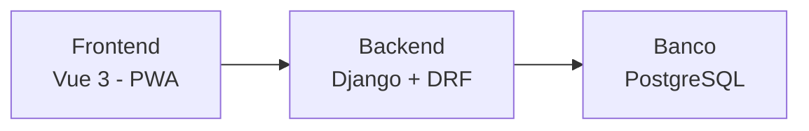
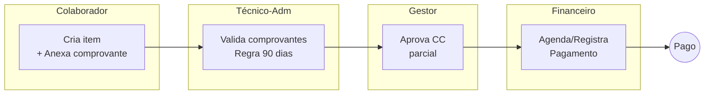

# Sistema de Gerenciamento de Reembolsos

<strong>Proposta de Solução e Planejamento | Janeiro 2026</strong>

## Síntese Executiva

Esta proposta apresenta um sistema que **formaliza o processo de reembolso corporativo**, substituindo planilhas e e-mails por um fluxo digital estruturado, com rastreabilidade completa e governança por design.

> O problema não é reembolso, é **governança de decisão distribuída**.
>
> A solução não é digitalizar planilhas, é **institucionalizar regras**.

## Navegação Rápida

- **[1. Visão Estratégica](docs/01-visao-estrategica.md)**: Problema, proposta de valor e impactos esperados
- **[2. High Level Design](docs/02-high-level-design.md)**: Arquitetura, stack tecnológica e fluxos
- **[3. Protótipos Visuais](docs/03-prototipos.md)**: Wireframes mobile e web por perfil
- **[4. Requisitos](docs/04-requisitos.md)**: Funcionais e não-funcionais
- **[5. Planejamento](docs/05-planejamento.md)**: Backlog, sprints e cronograma

## O Problema

O processo atual de reembolso corporativo apresenta **fragilidades estruturais**:

- Planilhas Excel não padronizadas
- E-mails dispersos sem rastreabilidade
- Consolidação manual trabalhosa
- Verificação manual da regra de 90 dias
- Dependência de conhecimento tácito ("funciona porque a Maria sabe como fazer")

**Resultado:** Ninguém sabe quem aprovou o quê, quando, e com base em qual informação.

## A Proposta

### Institucionalizar, não digitalizar

| O que **não** iremos fazer | O que faremos |
|-------------------|---------------|
| Digitalizar planilhas | Institucionalizar o processo |
| Trocar e-mail por chat | Automatizar validações |
| Criar mais burocracia | Rastrear cada decisão |

### Pilares da Solução

1. **Mobile-First (Progressive Web App - PWA)** - Registro no momento do gasto
2. **Governança por Design** - Trilha de auditoria imutável
3. **Aprovação Granular** - Por item, por centro de custo
4. **Resiliência Organizacional** - Sistema sobrevive à troca de gestão

## Arquitetura

**Monolito Modular** - Simples, pragmático, adequado ao MVP.

- **Complexidade:** Baixa (monolito modular, stack amplamente conhecida)
- **Time:** 2 Devs + 1 Tech Lead + 1 Consultor
- **Prazo:** 3-4 meses para MVP funcional
- **Custo de infra:** R$ 99-291/mês ([detalhamento](docs/02-high-level-design.md#8-estimativa-de-custos-de-infraestrutura))
- **Escalabilidade:** Horizontal (containers, orquestração futura)

---

## Escopo MVP

| MVP (Fase 1)                                    | Fase 2a                | Fase 2b                     |
|-------------------------------------------------|------------------------|-----------------------------|
| Cadastro de solicitações com múltiplos itens    | OCR de comprovantes    | Scanner QR Code + API SEFAZ |
| Upload obrigatório de comprovantes fiscais      | Push notifications     | Integração ERP              |
| Validação automática da regra de 90 dias        |                        | App nativo (Flutter)        |
| Fluxo de validação técnico-administrativa       |                        |                             |
| Aprovação por gestor (por centro de custo)      |                        |                             |
| Fila de pagamentos para o financeiro            |                        |                             |
| Notificações por e-mail                         |                        |                             |
| Trilha de auditoria completa                    |                        |                             |

---
## Premissas Assumidas

Durante a análise do case, algumas informações não foram explicitadas. Para viabilizar o design da solução, adotei as seguintes premissas, que devem ser validadas com os stakeholders antes do início do desenvolvimento.

### Contexto Organizacional

| Premissa | Valor Assumido | Impacto na Solução |
|----------|----------------|-------------------|
| Porte da empresa | ~500 colaboradores ativos | Dimensiona arquitetura e custos |
| Volume de solicitações | ~500/mês | Define requisitos de escalabilidade |
| Acesso mobile | Colaboradores possuem smartphones | Viabiliza abordagem PWA mobile-first |
| Cadastro de usuários | Já existe em sistema de RH | Sistema consome dados, não os cria |
| Centros de custo | Já estão definidos e mapeados | Sistema importa a estrutura existente |
| Dados bancários | Disponíveis para o financeiro | Não há cadastro bancário no sistema |

### Regras de Processo

| Premissa | Interpretação Adotada | Origem |
|----------|----------------------|--------|
| Ordem do fluxo | Técnico-adm valida **antes** do gestor aprovar | Inferido do case: técnico verifica conformidade primeiro |
| Vínculo item-CC | Cada item pertence a **um único** centro de custo | Simplificação; rateio fica para Fase 2 |
| Granularidade | Gestor aprova/rejeita **itens individuais** | Melhoria sobre AS-IS para reduzir retrabalho |
| Múltiplos gestores | Aprovação de **qualquer gestor** do CC é suficiente | Não há exigência de quórum |
| Aprovação paralela | Itens de CCs diferentes tramitam **simultaneamente** | Evita bloqueio sequencial |
| Regra de 90 dias | **Bloqueante** (impede submissão) | Interpretação de compliance |

### Decisões Técnicas

| Premissa | Valor Assumido | Justificativa |
|----------|----------------|---------------|
| Integração ERP | Não há no MVP | Complexidade; integração na Fase 2 |
| Ambiente de hospedagem | Cloud (GCP/AWS) | Não há restrição on-premises |
| Autenticação | Login/senha ou OAuth 2.0 + JWT | SSO corporativo (Google/Microsoft); sessões stateless |
| Formato de comprovantes | PDF, JPG, PNG (até 10MB) | Formatos mais comuns para NFs |

### Escopo Explicitamente Excluído do MVP

| Item Excluído | Motivo | Quando Entra |
|---------------|--------|--------------|
| OCR de comprovantes | Melhora UX, independe de API externa | Fase 2a |
| Push notifications | Requer infraestrutura adicional | Fase 2a |
| Integração API SEFAZ + QR Code | Dependência externa, SLA instável | Fase 2b |
| Integração ERP | Complexidade de integração | Fase 2b |
| App nativo (iOS/Android) | PWA suficiente para validar produto | Fase 2b |
| Rateio entre centros de custo | Complexidade adicional no fluxo | Fase 2b |
| Multi-idioma | Escopo Brasil | Fase 2 (se internacionalizar) |
| Multi-moeda | Escopo BRL | Fase 2 (despesas internacionais) |

> **Recomendação:** Validar estas premissas em sessão de alinhamento com stakeholders antes do início do desenvolvimento.

----

## Fluxo TO-BE

> **Diferencial:** Aprovação granular por centro de custo — cada gestor aprova apenas seus itens. Rejeições não bloqueiam o fluxo: itens aprovados seguem para pagamento independentemente.

---

## Cronograma Resumido

| Marco | Semana | Entrega |
|-------|--------|---------|
| M1 | 2 | Infraestrutura + CI/CD |
| M2 | 4 | Autenticação + CRUD básico |
| M3 | 8 | **MVP Básico** - Fluxo completo funcionando |
| M4 | 12 | Financeiro + Notificações + Ajustes |
| M5 | 14 | Relatórios + Testes |
| M6 | 16 | **Go-Live** |

## Equipe

| Papel | Responsabilidade |
|-------|------------------|
| **Tech Lead** | Arquitetura, code review, decisões técnicas |
| **Dev Backend** | API, banco, integrações |
| **Dev Frontend** | PWA Vue 3, UX mobile/web |
| **Consultor Especialista em Processos Financeiros** | Mapeamento, User Acceptance Testing (UAT), treinamento de usuários |

---

## Documentação Completa

Para detalhes técnicos, consulte a documentação na pasta `/docs`:

- [Visão Estratégica](docs/01-visao-estrategica.md) - Análise do problema e proposta de valor
- [High Level Design](docs/02-high-level-design.md) - Arquitetura e decisões técnicas
- [Protótipos](docs/03-prototipos.md) - Wireframes de todas as telas
- [Requisitos](docs/04-requisitos.md) - RF e RNF detalhados
- [Planejamento](docs/05-planejamento.md) - Backlog completo e cronograma

----
## Notas Finais

Este documento é uma proposta inicial sujeita a ajustes conforme feedback dos stakeholders e descobertas durante o desenvolvimento. O objetivo é entregar valor rapidamente com um MVP funcional, evoluindo a solução com base em necessidades reais e uso efetivo.

## Contato

[stellamaryane@gmail.com](mailto:stellamaryane@gmail.com)
[LinkedIn](https://www.linkedin.com/in/stellacost/)

---

*Proposta desenvolvida para o case EloGroup 2026* não vinculando qualquer relação comercial ou de emprego com a EloGroup.
