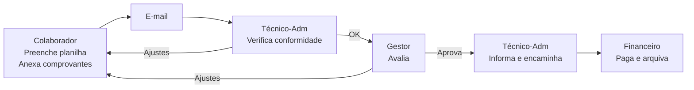
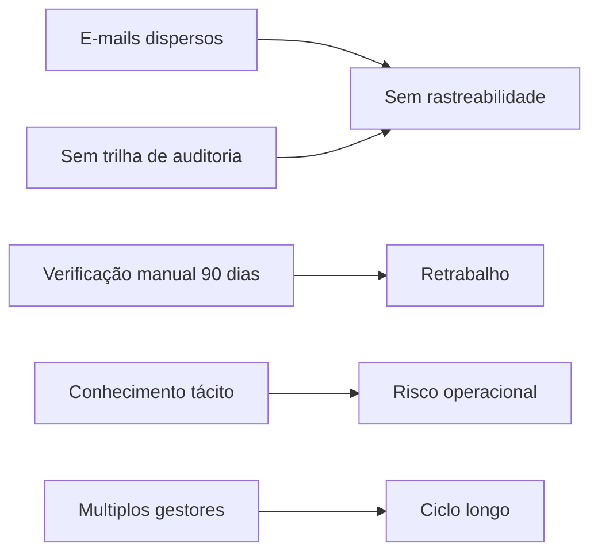
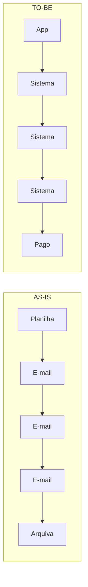

# Fluxo AS-IS - Processo Atual de Reembolsos

Este diagrama representa o processo atual de reembolsos, baseado em planilhas Excel e e-mails.

## Fluxo Principal

## Pontos de Dor

## Comparativo: AS-IS vs TO-BE

