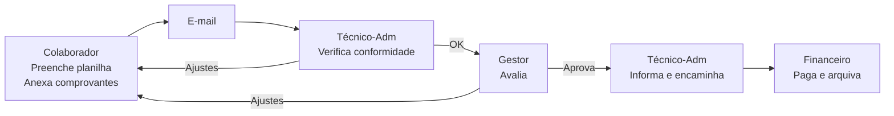
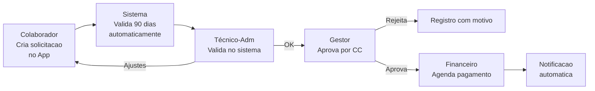
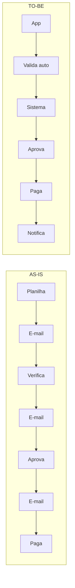
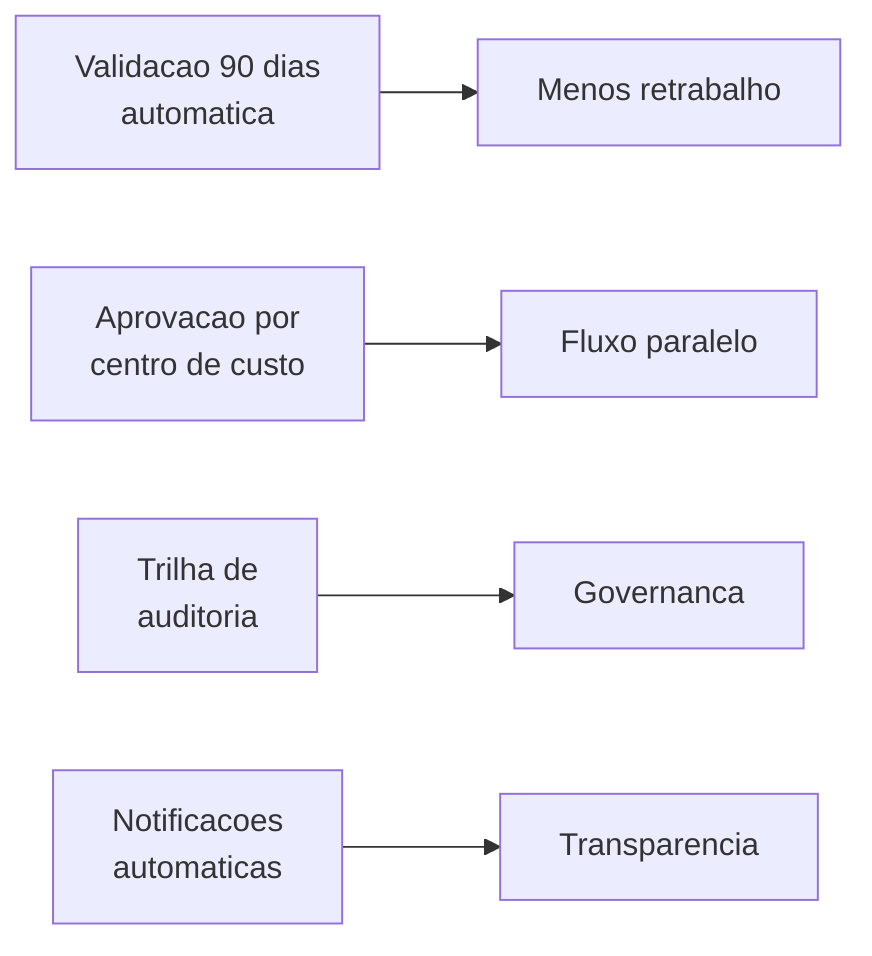

# Fluxos para Apresentação

## Fluxo AS-IS (Processo Atual)

```mermaid
flowchart LR
    A[Colaborador<br/>Preenche planilha<br/>Anexa comprovantes] --> B[E-mail]
    B --> C[Técnico-Adm<br/>Verifica conformidade]
    C -->|Ajustes| A
    C -->|OK| D[Gestor<br/>Avalia]
    D -->|Ajustes| A
    D -->|Aprova| E[Técnico-Adm<br/>Informa e encaminha]
    E --> F[Financeiro<br/>Paga e arquiva]
```

## Fluxo TO-BE (Processo Proposto)

```mermaid
flowchart LR
    A[Colaborador<br/>Cria solicitacao<br/>no App] --> B[Sistema<br/>Valida 90 dias<br/>automaticamente]
    B --> C[Técnico-Adm<br/>Valida no sistema]
    C -->|Ajustes| A
    C -->|OK| D[Gestor<br/>Aprova por CC]
    D -->|Rejeita| G[Registro com motivo]
    D -->|Aprova| E[Financeiro<br/>Agenda pagamento]
    E --> F[Notificacao<br/>automatica]
```

## Comparativo Lado a Lado

```mermaid
flowchart LR
    subgraph AS-IS
        direction TB
        A1[Planilha] --> A2[E-mail] --> A3[Verifica] --> A4[E-mail] --> A5[Aprova] --> A6[E-mail] --> A7[Paga]
    end

    subgraph TO-BE
        direction TB
        B1[App] --> B2[Valida auto] --> B3[Sistema] --> B4[Aprova] --> B5[Paga] --> B6[Notifica]
    end
```

## Diferenciais do TO-BE

```mermaid
flowchart LR
    D1[Validacao 90 dias<br/>automatica] --> R1[Menos retrabalho]
    D2[Aprovacao por<br/>centro de custo] --> R2[Fluxo paralelo]
    D3[Trilha de<br/>auditoria] --> R3[Governanca]
    D4[Notificacoes<br/>automaticas] --> R4[Transparencia]
```
