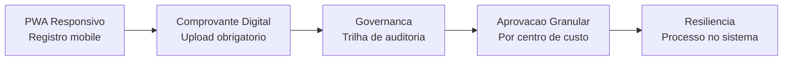
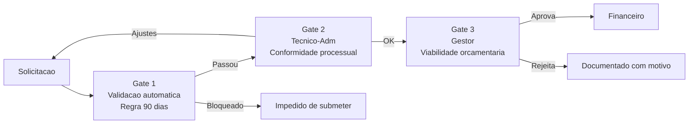
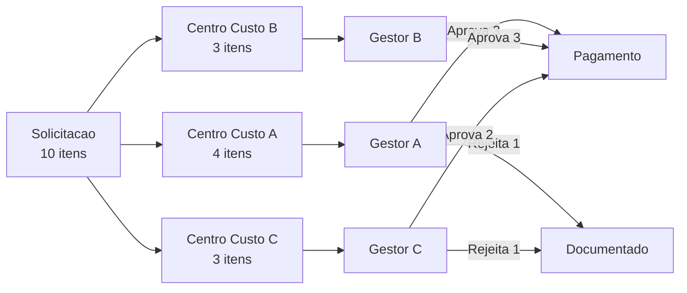
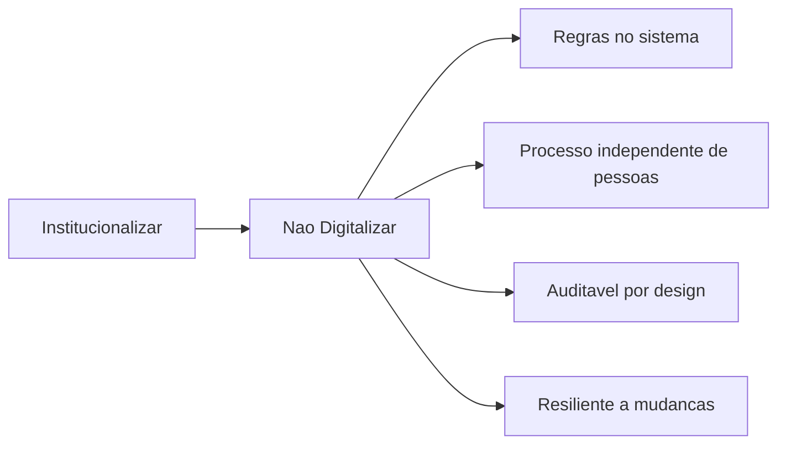

# Proposta: Institucionalizar, Nao Digitalizar

## Pilares da Solucao

```mermaid
flowchart LR
    P1[PWA Responsivo<br/>Registro mobile] --> P2[Comprovante Digital<br/>Upload obrigatorio]
    P2 --> P3[Governanca<br/>Trilha de auditoria]
    P3 --> P4[Aprovacao Granular<br/>Por centro de custo]
    P4 --> P5[Resiliencia<br/>Processo no sistema]
```

## Gates de Conformidade

```mermaid
flowchart LR
    A[Solicitacao] --> G1[Gate 1<br/>Validacao automatica<br/>Regra 90 dias]
    G1 -->|Passou| G2[Gate 2<br/>Tecnico-Adm<br/>Conformidade processual]
    G1 -->|Bloqueado| R1[Impedido de submeter]
    G2 -->|OK| G3[Gate 3<br/>Gestor<br/>Viabilidade orcamentaria]
    G2 -->|Ajustes| A
    G3 -->|Aprova| F[Financeiro]
    G3 -->|Rejeita| R2[Documentado com motivo]
```

## Aprovacao Granular

```mermaid
flowchart LR
    S[Solicitacao<br/>10 itens] --> CC1[Centro Custo A<br/>4 itens]
    S --> CC2[Centro Custo B<br/>3 itens]
    S --> CC3[Centro Custo C<br/>3 itens]

    CC1 --> G1[Gestor A]
    CC2 --> G2[Gestor B]
    CC3 --> G3[Gestor C]

    G1 -->|Aprova 3| P[Pagamento]
    G1 -->|Rejeita 1| D[Documentado]
    G2 -->|Aprova 3| P
    G3 -->|Aprova 2| P
    G3 -->|Rejeita 1| D
```

## Resumo Visual

```mermaid
flowchart LR
    I[Institucionalizar] --> N[Nao Digitalizar]

    N --> R1[Regras no sistema]
    N --> R2[Processo independente de pessoas]
    N --> R3[Auditavel por design]
    N --> R4[Resiliente a mudancas]
```
