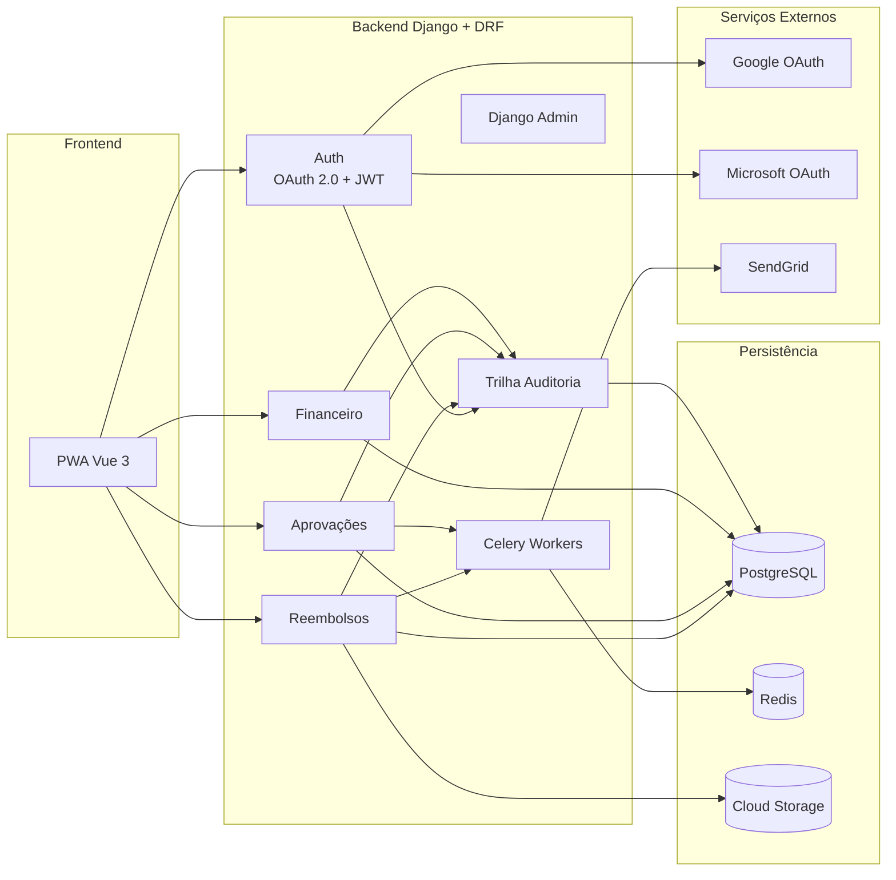
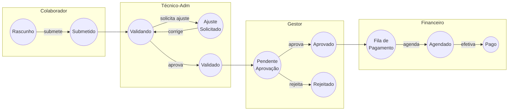
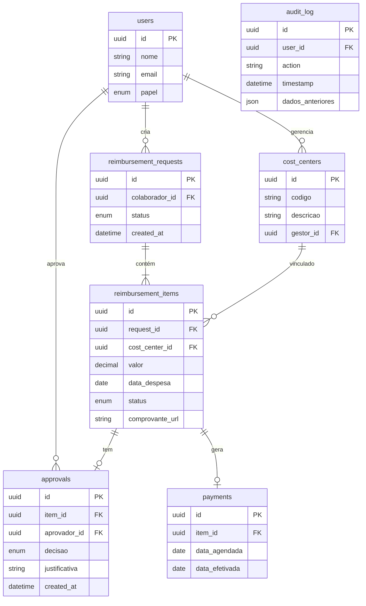
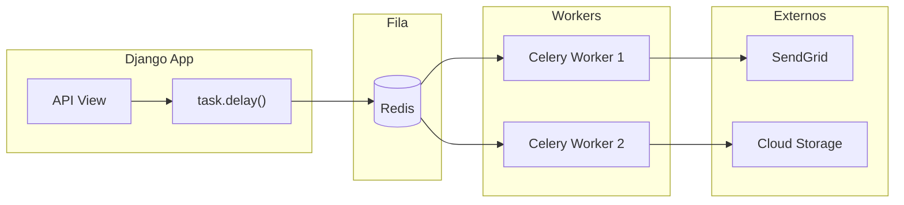
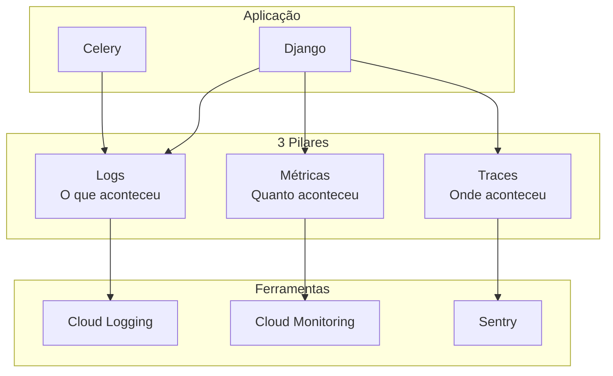
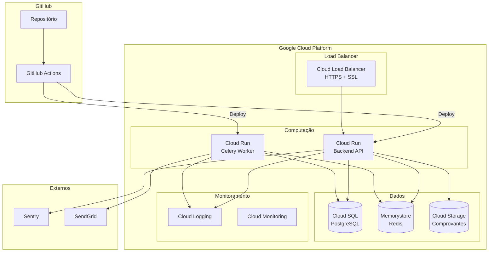
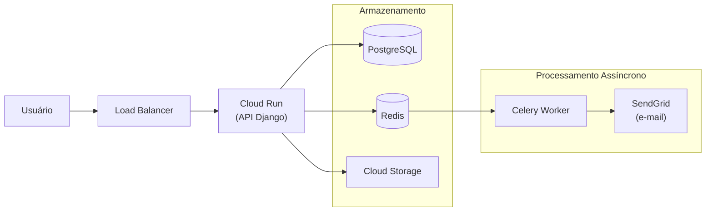
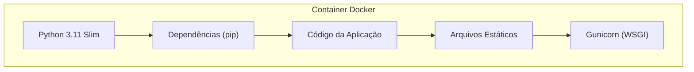
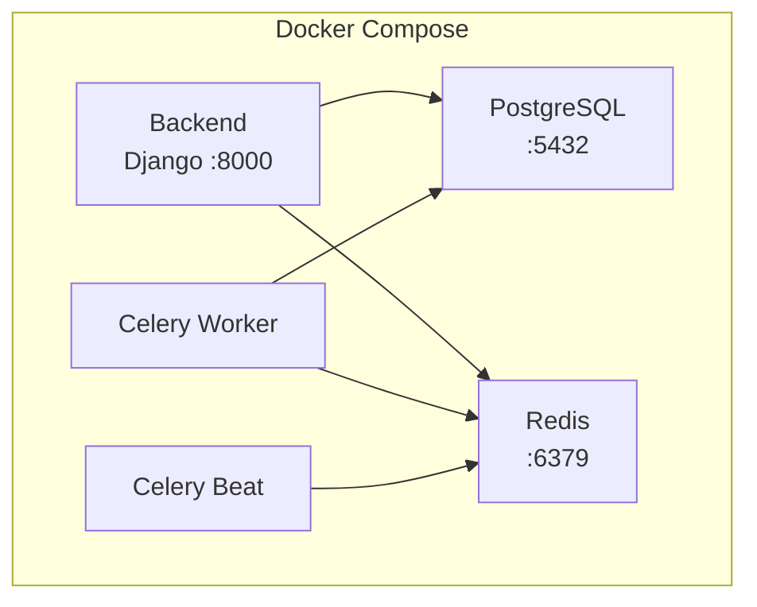

# High Level Design

[Voltar ao Resumo do projeto](../README.md)

---

## 1. Arquitetura Geral

### Abordagem: Monolito Modular

Optei por uma arquitetura **simples e pragmática** para o MVP, adequada ao tamanho da operação e ao time disponível.



### Descrição do Fluxo

**Frontend → Backend:**
O PWA (Vue 3) comunica-se com os apps Django via API REST (Django REST Framework). Todas as requisições passam pelo módulo de autenticação, que valida tokens JWT emitidos após login via OAuth 2.0 (Google ou Microsoft).

**Backend → Persistência:**
Cada app de negócio (Reembolsos, Aprovações, Financeiro) registra suas operações na Trilha de Auditoria antes de persistir no PostgreSQL. Comprovantes fiscais são armazenados no Google Cloud Storage com URLs assinadas para acesso seguro.

**Backend → Processamento Assíncrono:**
Operações que não devem bloquear o usuário (envio de e-mails, geração de thumbnails, relatórios) são delegadas ao **Celery**, que usa o **Redis** como broker de mensagens. Os Celery Workers processam as tarefas em background e se comunicam com serviços externos.

**Serviços Externos:**

- **Google/Microsoft OAuth:** Autenticação SSO corporativo
- **SendGrid:** Envio de e-mails transacionais (notificações de status, aprovações)
- **Sentry:** Captura de erros em produção (via SDK integrado)

**Back-office:**
O Django Admin oferece painel administrativo pronto para o financeiro e técnico-administrativo, com visualização de solicitações, gestão de usuários e logs de auditoria.

### Por que Monolito Modular?

| Critério         | Monolito Modular     | Microserviços          |
| ---------------- | -------------------- | ---------------------- |
| Complexidade     | Baixa                | Alta                   |
| Time necessário  | 2 Devs + 1 Tech Lead | 4+ Devs especializados |
| Tempo de entrega | 3-4 meses            | 6-8 meses              |
| Custo de infra   | Baixo                | Alto                   |
| Manutenção       | Simples              | Requer DevOps dedicado |

**Evolução futura:** Se a operação crescer significativamente, podemos extrair módulos para serviços independentes.

---

## 2. Máquina de Estados (State Machine)

### Estados do Item (Granular)

Cada **item de despesa** possui um ciclo de vida independente:

| Estado                | Descrição                  | Responsável |
| --------------------- | -------------------------- | ----------- |
| `DRAFT`               | Item criado, não submetido | Colaborador |
| `SUBMITTED`           | Enviado para análise       | Sistema     |
| `ADMIN_VALIDATING`    | Em análise técnico-adm     | Técnico-adm |
| `NEEDS_ADJUSTMENT`    | Ajustes solicitados        | Técnico-adm |
| `ADMIN_OK`            | Validação aprovada         | Técnico-adm |
| `PENDING_APPROVAL_CC` | Aguardando gestor do CC    | Sistema     |
| `MANAGER_APPROVED`    | Aprovado pelo gestor       | Gestor      |
| `MANAGER_REJECTED`    | Rejeitado pelo gestor      | Gestor      |
| `READY_FOR_PAYMENT`   | Na fila de pagamento       | Sistema     |
| `PAYMENT_SCHEDULED`   | Pagamento agendado         | Financeiro  |
| `PAID`                | Pagamento efetivado        | Financeiro  |

### Fluxo Visual



### Estados da Solicitação (Agregado)

| Estado               | Condição                             |
| -------------------- | ------------------------------------ |
| `DRAFT`              | Todos os itens em DRAFT              |
| `IN_REVIEW`          | Ao menos 1 item em análise           |
| `PARTIALLY_APPROVED` | Alguns aprovados, outros rejeitados  |
| `FULLY_APPROVED`     | Todos aprovados                      |
| `PAID`               | Todos os itens aprovados foram pagos |

---

## 3. Stack Tecnológica

| Camada              | Tecnologia                             | Justificativa                                    |
| ------------------- | -------------------------------------- | ------------------------------------------------ |
| **Frontend**        | Vue 3 + TypeScript + Vite              | Curva de aprendizado menor, Composition API      |
| **UI Components**   | Vuetify 3                              | Componentes responsivos, Material Design         |
| **Estado Global**   | Pinia                                  | Oficial Vue 3, type-safe                         |
| **Backend**         | Python 3.11 + Django 5                 | Framework completo, equipe experiente            |
| **API**             | Django REST Framework                  | Serializers, viewsets, permissões integradas     |
| **Admin**           | Django Admin                           | Back-office pronto para financeiro/técnico-adm   |
| **ORM**             | Django ORM                             | Migrations integradas, queries otimizadas        |
| **Validação**       | DRF Serializers + Model validators     | Validação em camadas                             |
| **Database**        | PostgreSQL 16                          | ACID, JSON support, confiável (suporte até 2028) |
| **Cache/Filas**     | Redis + Celery                         | Tarefas assíncronas (e-mails, uploads)           |
| **Arquivos**        | Google Cloud Storage                   | Comprovantes fiscais, URLs assinadas             |
| **Autenticação**    | OAuth 2.0 (Google/Microsoft) + JWT     | SSO corporativo, sessão stateless                |
| **Email**           | Celery + SendGrid                      | Envio assíncrono de notificações                 |
| **Observabilidade** | Cloud Logging + Sentry + OpenTelemetry | Logs, erros, traces distribuídos                 |
| **Deploy**          | Docker + Cloud Run                     | Simples, escalável, baixo custo                  |
| **CI/CD**           | GitHub Actions                         | Gratuito, integrado                              |

---

## 4. Componentes Principais

Descrição dos principais componentes do sistema:

### Frontend (PWA Responsivo)

**Por que PWA no MVP?**

- Uma única codebase serve mobile e desktop
- Instalável como app (ícone na home do celular)
- Sem fricção de instalação (não precisa da store)
- Atualizações instantâneas
- 1 Dev Frontend suficiente

| Mobile                                 | Web                              |
| -------------------------------------- | -------------------------------- |
| Criar solicitação e adicionar itens    | Upload por arrastar e soltar     |
| Captura de comprovante via câmera      | Validação em lote                |
| Acompanhamento de status em tempo real | Dashboards com filtros avançados |
| Aprovação de itens para gestores       | Exportação de relatórios         |

### Backend (Django + Django REST Framework)

O backend é organizado em **apps Django por domínio**, seguindo o padrão do framework:

| App               | Responsabilidade                                      | Exemplo de Endpoints                                       |
| ----------------- | ----------------------------------------------------- | ---------------------------------------------------------- |
| `accounts/`       | Login, logout, validação de token, controle de papéis | `POST /api/auth/login`, `GET /api/auth/me`                 |
| `reimbursements/` | Criar, listar, editar solicitações                    | `POST /api/reimbursements`, `GET /api/reimbursements/{id}` |
| `items/`          | Adicionar/remover itens, upload de comprovante        | `POST /api/reimbursements/{id}/items`                      |
| `approvals/`      | Validação técnica, aprovação do gestor, transições    | `POST /api/items/{id}/approve`                             |
| `payments/`       | Agendar pagamento, registrar efetivação               | `POST /api/items/{id}/schedule-payment`                    |
| `audit/`          | Registrar ações, consultar histórico                  | `GET /api/audit-log?request_id=123`                        |

**Django Admin (Back-office):**

O Django Admin oferece um painel administrativo pronto para uso, customizável para as necessidades do financeiro e técnico-administrativo:

- Visualização e filtro de todas as solicitações
- Gestão de usuários e permissões
- Relatórios e exportação de dados
- Logs de auditoria

**Validações de Negócio:**

O sistema valida automaticamente as regras antes de aceitar dados.
Exemplo de Model e Serializer Django para validar que a data da despesa não pode ter mais de 90 dias:

```python
# =============================================================================
# models.py - Definição do Model (estrutura de dados no banco)
# =============================================================================

from django.db import models                    # ORM do Django para criar tabelas
from django.core.exceptions import ValidationError  # Exceção para erros de validação
from datetime import date                       # Para trabalhar com datas


def validar_regra_90_dias(data_despesa):
    """
    Validador customizado que impede despesas com mais de 90 dias.

    Esta função é chamada automaticamente pelo Django sempre que
    alguém tenta salvar um item de reembolso. Se a despesa for
    antiga demais, o sistema bloqueia antes de salvar no banco.

    Args:
        data_despesa: A data em que a despesa ocorreu

    Raises:
        ValidationError: Se a despesa tiver mais de 90 dias
    """
    dias_decorridos = (date.today() - data_despesa).days
    if dias_decorridos > 90:
        raise ValidationError('Despesas com mais de 90 dias não são permitidas')


class ItemReembolso(models.Model):
    """
    Representa um item individual dentro de uma solicitação de reembolso.

    Uma solicitação pode ter múltiplos itens, cada um com seu próprio
    valor, data, centro de custo e comprovante. Isso permite aprovação
    granular: o gestor pode aprovar alguns itens e rejeitar outros.
    """

    # Valor da despesa (até 99.999.999,99)
    valor = models.DecimalField(
        max_digits=10,
        decimal_places=2,
        verbose_name='Valor da despesa'
    )

    # Data da despesa - validada automaticamente pela regra dos 90 dias
    data_despesa = models.DateField(
        validators=[validar_regra_90_dias],
        verbose_name='Data da despesa'
    )

    # Centro de custo - PROTECT impede exclusão de centro que tenha itens
    centro_custo = models.ForeignKey(
        'CentroCusto',
        on_delete=models.PROTECT,
        verbose_name='Centro de custo'
    )

    # Solicitação pai - CASCADE exclui itens se a solicitação for excluída
    solicitacao = models.ForeignKey(
        'SolicitacaoReembolso',
        on_delete=models.CASCADE,
        verbose_name='Solicitação'
    )

    # Arquivo do comprovante (PDF, JPG, PNG)
    comprovante = models.FileField(
        upload_to='comprovantes/',
        verbose_name='Comprovante fiscal'
    )

    # Status do item no fluxo de aprovação
    status = models.CharField(
        max_length=20,
        default='RASCUNHO',
        verbose_name='Status'
    )


# =============================================================================
# serializers.py - Conversão entre JSON da API e objetos Python
# =============================================================================

from rest_framework import serializers


class ItemReembolsoSerializer(serializers.ModelSerializer):
    """
    Serializer converte dados entre formato JSON (API) e Model (banco).

    Quando o frontend envia um POST com JSON, o serializer valida
    os dados e cria o objeto. Quando o frontend faz GET, o serializer
    converte o objeto do banco para JSON.
    """

    class Meta:
        model = ItemReembolso

        # Campos expostos na API
        fields = ['id', 'valor', 'data_despesa', 'centro_custo', 'comprovante', 'status']

        # Status é somente leitura - só o sistema pode alterar
        read_only_fields = ['status']
```

> **Importante:** A regra dos 90 dias é validada automaticamente no Model. Se a data da despesa ultrapassar o limite, o sistema rejeita a submissão antes mesmo de entrar no fluxo.

### PostgreSQL - Camada de Dados Estruturados

**Por que PostgreSQL?**

- **ACID:** Garante integridade em transações financeiras (se o pagamento falhar, tudo é revertido)
- **Confiabilidade:** Banco maduro, usado em produção há décadas
- **JSON nativo:** Permite armazenar dados flexíveis (ex: metadados de comprovantes)
- **Gratuito:** Open source, sem custo de licença
- **Escalável:** Suporta crescimento conforme a operação aumenta



**Relacionamentos do Sistema:**

| Relação                                      | Tipo | Descrição                                                      |
| -------------------------------------------- | ---- | -------------------------------------------------------------- |
| users → reimbursement_requests               | 1:N  | Um colaborador cria várias solicitações ao longo do tempo      |
| users → cost_centers                         | 1:N  | Um gestor pode ser responsável por vários centros de custo     |
| reimbursement_requests → reimbursement_items | 1:N  | Uma solicitação contém vários itens de despesa                 |
| cost_centers → reimbursement_items           | 1:N  | Um centro de custo recebe itens de vários colaboradores        |
| reimbursement_items → approvals              | 1:N  | Um item pode ter várias aprovações (ex: ajuste e re-aprovação) |
| reimbursement_items → payments               | 1:1  | Cada item aprovado gera exatamente um registro de pagamento    |
| users → approvals                            | 1:N  | Um gestor aprova vários itens de diferentes solicitações       |
| users → audit_log                            | 1:N  | Cada ação do usuário gera um registro de auditoria             |

### Object Storage (Google Cloud Storage)

Comprovantes fiscais são armazenados separadamente do banco de dados. Isso é uma boa prática porque:

- **Performance:** Banco de dados é otimizado para consultas, não para arquivos grandes
- **Custo:** Storage de arquivos é muito mais barato que espaço em banco
- **Escalabilidade:** Cloud Storage escala automaticamente sem limite prático

**Solução escolhida: Google Cloud Storage**

| Configuração      | Valor                          | Justificativa                                                                                  |
| ----------------- | ------------------------------ | ---------------------------------------------------------------------------------------------- |
| **Classe**        | Standard                       | Acesso frequente nos primeiros meses                                                           |
| **Região**        | southamerica-east1 (São Paulo) | Menor latência para usuários no Brasil                                                         |
| **Lifecycle**     | Nearline após 90 dias          | Reduz custo de arquivos antigos - Após 90 dias, raramente são consultados (exemplo: auditoria) |
| **Retenção**      | 7 anos (retention policy)      | Conformidade fiscal                                                                            |
| **Versionamento** | Desativado                     | Comprovantes são imutáveis                                                                     |

**Estrutura de pastas no bucket:**

```bash
gs://reembolsos-comprovantes/
  └── requests/
      └── {request_id}/
          └── items/
              └── {item_id}/
                  ├── original.pdf      ← Arquivo enviado pelo colaborador
                  └── thumbnail.jpg     ← Miniatura gerada automaticamente
```

**Especificações:**

| Item             | Valor                                   |
| ---------------- | --------------------------------------- |
| Formatos aceitos | PDF, JPG, PNG                           |
| Tamanho máximo   | 10 MB por arquivo                       |
| Acesso           | URLs assinadas (válidas por 15 minutos) |
| Custo estimado   | ~R$ 1-3/mês para 50GB                   |

## 5. Processamento Assíncrono (Filas)

### Por que usar filas?

Algumas operações não devem bloquear a resposta ao usuário:

| Operação              | Problema sem fila                  | Solução com fila                               |
| --------------------- | ---------------------------------- | ---------------------------------------------- |
| Envio de e-mail       | Usuário espera 2-5s pelo SendGrid  | Retorna imediato, e-mail enviado em background |
| Upload de comprovante | Compressão bloqueia a requisição   | Upload aceito, processamento assíncrono        |
| Geração de relatório  | Timeout em relatórios grandes      | Gera em background, notifica quando pronto     |
| Notificações em lote  | Múltiplos e-mails atrasam resposta | Enfileira tudo, processa gradualmente          |

### Stack: Celery + Redis



## 6. Observabilidade

### Os 3 Pilares



### Stack de Observabilidade

| Pilar        | Ferramenta       | O que monitora                        | Custo             |
| ------------ | ---------------- | ------------------------------------- | ----------------- |
| **Logs**     | Cloud Logging    | Logs estruturados da aplicação        | Incluído no GCP   |
| **Métricas** | Cloud Monitoring | CPU, memória, latência, requests      | Incluído no GCP   |
| **Traces**   | Cloud Trace      | Tempo de cada requisição end-to-end   | Incluído no GCP   |
| **Erros**    | Sentry           | Exceptions com stack trace e contexto | Free tier: 5k/mês |
| **APM**      | OpenTelemetry    | Instrumentação padronizada            | Open source       |

### Métricas de Negócio

Além das métricas técnicas, monitoramos indicadores de negócio:

| Métrica                     | Descrição                 | Alerta se                |
| --------------------------- | ------------------------- | ------------------------ |
| `reimbursement.created`     | Solicitações criadas/hora | < 1 em horário comercial |
| `reimbursement.approved`    | Taxa de aprovação         | < 70%                    |
| `reimbursement.cycle_time`  | Tempo médio até pagamento | > 7 dias                 |
| `reimbursement.rework_rate` | Taxa de retrabalho        | > 20%                    |

---

## 7. Deployment e CI/CD

### Arquitetura de Deploy (GCP)



### Descrição do Fluxo de Deploy

**1. GitHub (Origem do Código)**

| Componente         | Função                                                               |
| ------------------ | -------------------------------------------------------------------- |
| **Repositório**    | Armazena o código-fonte, branches (`main`, `develop`, `feature/*`)   |
| **GitHub Actions** | Executa o pipeline CI/CD automaticamente a cada push ou pull request |

**2. Pipeline CI/CD (GitHub Actions)**

O pipeline é acionado automaticamente e executa as seguintes etapas:

```
Push/PR → Testes → Linting → Build Docker → Push Image → Deploy
```

| Etapa                 | O que faz                                          | Falha se...                      |
| --------------------- | -------------------------------------------------- | -------------------------------- |
| **Test**              | Executa pytest com cobertura mínima de 80%         | Testes falham ou cobertura < 80% |
| **Lint**              | Verifica código com Ruff (PEP8, imports)           | Código fora do padrão            |
| **Build**             | Cria imagem Docker e envia para Container Registry | Dockerfile inválido              |
| **Deploy Staging**    | Faz deploy automático no ambiente de staging       | Falha no Cloud Run               |
| **Deploy Production** | Requer aprovação manual antes de executar          | Não aprovado                     |

**3. Google Cloud Platform (Infraestrutura)**

| Camada            | Componente          | Função                                                           |
| ----------------- | ------------------- | ---------------------------------------------------------------- |
| **Load Balancer** | Cloud Load Balancer | Recebe requisições HTTPS, termina SSL, distribui para instâncias |
| **Computação**    | Cloud Run (API)     | Executa o backend Django, escala automaticamente de 0 a N        |
| **Computação**    | Cloud Run (Worker)  | Executa Celery workers para tarefas assíncronas                  |
| **Dados**         | Cloud SQL           | Banco PostgreSQL gerenciado com backup automático                |
| **Dados**         | Memorystore         | Redis gerenciado para filas do Celery                            |
| **Dados**         | Cloud Storage       | Armazena comprovantes fiscais com URLs assinadas                 |
| **Monitoramento** | Cloud Logging       | Centraliza logs de todos os serviços                             |
| **Monitoramento** | Cloud Monitoring    | Métricas de CPU, memória, latência, alertas                      |

**4. Serviços Externos**

| Serviço      | Função                                 | Integração                     |
| ------------ | -------------------------------------- | ------------------------------ |
| **Sentry**   | Captura erros/exceptions em tempo real | SDK Python integrado ao Django |
| **SendGrid** | Envia e-mails transacionais            | Chamado pelos Celery workers   |

**5. Fluxo de uma Requisição**



1. Usuário acessa `reembolsos.empresa.com`
2. Load Balancer recebe a requisição HTTPS e encaminha para Cloud Run
3. Cloud Run (API) processa a requisição Django
4. Se necessário, enfileira tarefa no Redis (ex: enviar e-mail)
5. Celery Worker pega a tarefa da fila e executa
6. Logs são enviados para Cloud Logging, erros para Sentry

### Pipeline CI/CD

O pipeline é executado automaticamente pelo GitHub Actions a cada push ou pull request.

```mermaid
flowchart LR
    subgraph Trigger["Gatilho"]
        Push["Push/PR"]
    end

    subgraph CI["Integração Contínua"]
        Checkout["Checkout"]
        Deps["Instalar Deps"]
        Lint["Linting (Ruff)"]
        Test["Testes (pytest)"]
        Coverage["Cobertura ≥ 80%"]
    end

    subgraph Build["Build"]
        Docker["Build Docker"]
        Push_GCR["Push para GCR"]
    end

    subgraph CD["Deploy"]
        Staging["Deploy Staging"]
        Approval["Aprovação Manual"]
        Prod["Deploy Production"]
    end

    Push --> Checkout --> Deps --> Lint --> Test --> Coverage
    Coverage --> Docker --> Push_GCR
    Push_GCR --> Staging
    Staging --> Approval --> Prod
```



#### Etapas do Pipeline

| Etapa                     | Descrição                             | Ferramentas                 | Critério de Sucesso     |
| ------------------------- | ------------------------------------- | --------------------------- | ----------------------- |
| **Checkout**              | Baixa o código do repositório         | GitHub Actions              | -                       |
| **Instalar Dependências** | Instala pacotes Python                | pip + requirements.txt      | Sem erros               |
| **Linting**               | Verifica padrões de código            | Ruff (PEP8)                 | Zero violações          |
| **Testes**                | Executa testes unitários e integração | pytest + PostgreSQL + Redis | Todos passando          |
| **Cobertura**             | Verifica cobertura de código          | pytest-cov                  | ≥ 80%                   |
| **Build Docker**          | Cria imagem containerizada            | Docker Buildx               | Build sem erros         |
| **Push para GCR**         | Envia imagem para Container Registry  | Google Container Registry   | Upload completo         |
| **Deploy Staging**        | Deploya em ambiente de testes         | Cloud Run                   | Health check OK         |
| **Aprovação**             | Aguarda aprovação manual              | GitHub Environments         | Aprovado por maintainer |
| **Deploy Production**     | Deploya em produção                   | Cloud Run                   | Health check OK         |

### Containerização (Docker)

A aplicação é empacotada em containers Docker para garantir consistência entre ambientes.



### Ambiente de Desenvolvimento Local

Para desenvolvimento local, usamos Docker Compose para orquestrar os serviços.



## 8. Estimativa de Custos de Infraestrutura

### Cenário MVP (Monolito Modular)

**Premissas para dimensionamento do MVP:**

- ~500 usuários ativos (sistema suporta até 10.000 - ver RNF02.1)
- ~500 solicitações/mês (sistema suporta até 50.000 - ver RNF02.2)
- Armazenamento de ~50GB de comprovantes/ano

#### Google Cloud Platform (GCP)

| Serviço                    | Especificação                  | Custo Mensal (USD) |
| -------------------------- | ------------------------------ | -----------------: |
| **Cloud Run (API)**        | 1 instância, 1 vCPU, 512MB RAM |           $0 - $10 |
| **Cloud Run (Celery)**     | 1 instância, 1 vCPU, 512MB RAM |           $0 - $10 |
| **Cloud SQL (PostgreSQL)** | db-f1-micro, 10GB SSD          |          $10 - $15 |
| **Memorystore (Redis)**    | Basic, 1GB                     |          $15 - $20 |
| **Cloud Storage**          | 50GB Standard, Class A/B ops   |            $1 - $3 |
| **Secret Manager**         | 10 secrets, 10k acessos        |                 $0 |
| **Cloud Build**            | 120 min/dia free tier          |                 $0 |
| **Networking**             | Egress ~10GB/mês               |                 $1 |
| **Total GCP**              |                                |      **$27 - $59** |

> **Nota:** Cloud Run cobra por uso real (requests + tempo de execução). Com baixo tráfego, custo próximo de zero.

**Detalhamento de cada serviço:**

| Serviço | O que faz | Por que este dimensionamento |
| ------- | --------- | ---------------------------- |
| **Cloud Run (API)** | Executa o backend Django que processa requisições HTTP | 512MB suficiente para Django + DRF; escala para zero quando ocioso |
| **Cloud Run (Celery)** | Processa tarefas em background (e-mails, uploads) | Mesmo dimensionamento; pode escalar independente da API |
| **Cloud SQL** | Banco PostgreSQL gerenciado com backup automático | db-f1-micro suporta ~500 conexões simultâneas; 10GB comporta anos de dados |
| **Memorystore** | Redis para filas do Celery e cache | 1GB comporta milhares de tarefas enfileiradas |
| **Cloud Storage** | Armazena comprovantes fiscais (PDFs, imagens) | Standard para acesso frequente; Nearline automático após 90 dias |
| **Secret Manager** | Guarda credenciais (API keys, senhas de banco) | Free tier cobre necessidades do MVP |
| **Cloud Build** | Constrói imagens Docker no CI/CD | 120 min/dia gratuitos = ~4 builds diários |
| **Networking** | Tráfego de saída (respostas, downloads) | 10GB/mês conservador para ~500 usuários |

**Referências de preços (documentação oficial Google Cloud):**

- [Cloud Run Pricing](https://cloud.google.com/run/pricing)
- [Cloud SQL Pricing](https://cloud.google.com/sql/pricing)
- [Cloud Storage Pricing](https://cloud.google.com/storage/pricing)
- [Calculadora de preços GCP](https://cloud.google.com/products/calculator)

### Custos Adicionais (Opcionais)

Serviços complementares que podem ser necessários dependendo das necessidades do projeto:

#### Envio de E-mails (SendGrid)

O sistema precisa enviar notificações por e-mail (ex: "Sua solicitação foi aprovada").

| Plano      | Limite         | Custo | Quando usar                |
| ---------- | -------------- | ----- | -------------------------- |
| Free       | 100 emails/dia | $0    | MVP e testes               |
| Essentials | 50k emails/mês | $20   | Produção com ~500 usuários |

> **Alternativa GCP:** Pode-se usar SMTP próprio ou integrar com Gmail API para volumes menores.

#### Monitoramento e Erros (Sentry)

Ferramenta que captura erros em produção e notifica o time de desenvolvimento.

| Plano     | Limite        | Custo | Quando usar |
| --------- | ------------- | ----- | ----------- |
| Developer | 5k erros/mês  | $0    | MVP         |
| Team      | 50k erros/mês | $26   | Produção    |

> **Por que usar:** Sem monitoramento, erros em produção passam despercebidos. Sentry mostra exatamente onde o erro ocorreu e qual usuário foi afetado.

#### Repositório de Código (GitHub)

| Plano | Recursos                                | Custo          |
| ----- | --------------------------------------- | -------------- |
| Free  | Repos privados, Actions limitado        | $0             |
| Team  | Actions ilimitado, code review avançado | $4/usuário/mês |

#### Detalhamento de custo do MVP Recomendado (mensal)

| Componente                   |     Custo (USD) |      Custo (BRL) |
| ---------------------------- | --------------: | ---------------: |
| Cloud Run (API + Celery)     |      USD 5 - 20 |      R$ 30 - 120 |
| Cloud SQL (PostgreSQL)       |     USD 10 - 15 |       R$ 60 - 90 |
| Memorystore (Redis)          |     USD 15 - 20 |      R$ 90 - 120 |
| Cloud Storage (comprovantes) |       USD 1 - 3 |        R$ 6 - 18 |
| SendGrid (e-mails)           |      USD 0 - 20 |       R$ 0 - 120 |
| Sentry (monitoramento)       |           USD 0 |             R$ 0 |
| **Total MVP Recomendado**    | **USD 31 - 78** | **R$ 186 - 468** |

> **Observação:** Os valores podem variar conforme uso real. GCP cobra por consumo, então meses com pouco uso custam menos.
> _Cotação atualizada: USD 1 = BRL 6,00 (janeiro/2026)_

---

### Justificativa da Escolha de Infraestrutura

1. **Pay-per-use**: Cobra apenas por requisições processadas
2. **Auto-scaling**: Escala automaticamente de 0 a N instâncias
3. **Free tier generoso**: 2 milhões de requests/mês gratuitos
4. **Simplicidade**: Deploy via Docker, sem gerenciar servidores
5. **PostgreSQL gerenciado**: Backup automático, patches de segurança

---

[Anterior: Visão Estratégica](01-visao-estrategica.md) | [Próximo: Protótipos](03-prototipos.md)
