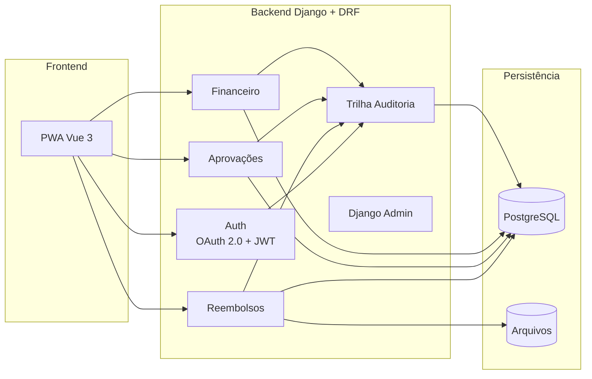
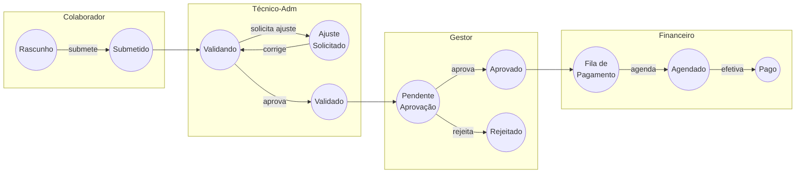
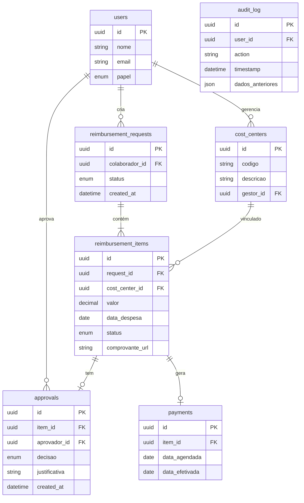

# High Level Design

[Voltar ao Resumo do projeto](../README.md)

---

## 1. Arquitetura Geral

### Abordagem: Monolito Modular

Optei por uma arquitetura **simples e pragmática** para o MVP, adequada ao tamanho da operação e ao time disponível.



**Fluxo:** O PWA (frontend) comunica-se com os apps Django via API REST (Django REST Framework). Cada app de negócio (Reembolsos, Aprovações, Financeiro) registra suas operações na Trilha de Auditoria antes de persistir no PostgreSQL. O Django Admin oferece back-office pronto para o financeiro e técnico-administrativo. Comprovantes fiscais são armazenados separadamente no storage de arquivos, vinculados às solicitações.

### Por que Monolito Modular?

| Critério | Monolito Modular | Microserviços |
|----------|------------------|---------------|
| Complexidade | Baixa | Alta |
| Time necessário | 2 Devs + 1 Tech Lead | 4+ Devs especializados |
| Tempo de entrega | 3-4 meses | 6-8 meses |
| Custo de infra | Baixo | Alto |
| Manutenção | Simples | Requer DevOps dedicado |

**Evolução futura:** Se a operação crescer significativamente, podemos extrair módulos para serviços independentes.

---

## 2. Máquina de Estados (State Machine)

### Estados do Item (Granular)

Cada **item de despesa** possui um ciclo de vida independente:

| Estado | Descrição | Responsável |
|--------|-----------|-------------|
| `DRAFT` | Item criado, não submetido | Colaborador |
| `SUBMITTED` | Enviado para análise | Sistema |
| `ADMIN_VALIDATING` | Em análise técnico-adm | Técnico-adm |
| `NEEDS_ADJUSTMENT` | Ajustes solicitados | Técnico-adm |
| `ADMIN_OK` | Validação aprovada | Técnico-adm |
| `PENDING_APPROVAL_CC` | Aguardando gestor do CC | Sistema |
| `MANAGER_APPROVED` | Aprovado pelo gestor | Gestor |
| `MANAGER_REJECTED` | Rejeitado pelo gestor | Gestor |
| `READY_FOR_PAYMENT` | Na fila de pagamento | Sistema |
| `PAYMENT_SCHEDULED` | Pagamento agendado | Financeiro |
| `PAID` | Pagamento efetivado | Financeiro |


### Fluxo Visual




### Estados da Solicitação (Agregado)

| Estado | Condição |
|--------|----------|
| `DRAFT` | Todos os itens em DRAFT |
| `IN_REVIEW` | Ao menos 1 item em análise |
| `PARTIALLY_APPROVED` | Alguns aprovados, outros rejeitados |
| `FULLY_APPROVED` | Todos aprovados |
| `PAID` | Todos os itens aprovados foram pagos |

---

## 3. Stack Tecnológica

| Camada | Tecnologia | Justificativa |
|--------|------------|---------------|
| **Frontend** | Vue 3 + TypeScript + Vite | Curva de aprendizado menor, Composition API |
| **UI Components** | Vuetify 3 | Componentes responsivos, Material Design |
| **Estado Global** | Pinia | Oficial Vue 3, type-safe |
| **Backend** | Python 3.11 + Django 5 | Framework completo, equipe experiente |
| **API** | Django REST Framework | Serializers, viewsets, permissões integradas |
| **Admin** | Django Admin | Back-office pronto para financeiro/técnico-adm |
| **ORM** | Django ORM | Migrations integradas, queries otimizadas |
| **Validação** | DRF Serializers + Model validators | Validação em camadas |
| **Database** | PostgreSQL 16 | ACID, JSON support, confiável (suporte até 2028) |
| **Arquivos** | Filesystem / S3 | MVP: local; Produção: cloud |
| **Autenticação** | Django Auth + SimpleJWT | Login corporativo, sessão stateless |
| **Email** | Django Email + SendGrid | Notificações de status |
| **Deploy** | Docker + Cloud Run | Simples, escalável, baixo custo |
| **CI/CD** | GitHub Actions | Gratuito, integrado |

---

## 4. Componentes Principais

Descrição dos principais componentes do sistema:

### Frontend (PWA Responsivo)

**Por que PWA no MVP?**

- Uma única codebase serve mobile e desktop
- Instalável como app (ícone na home do celular)
- Sem fricção de instalação (não precisa da store)
- Atualizações instantâneas
- 1 Dev Frontend suficiente

| Mobile                                  | Web                                     |
|-----------------------------------------|-----------------------------------------|
| Criar solicitação e adicionar itens     | Upload por arrastar e soltar            |
| Captura de comprovante via câmera       | Validação em lote                       |
| Acompanhamento de status em tempo real  | Dashboards com filtros avançados        |
| Aprovação de itens para gestores        | Exportação de relatórios                |

### Backend (Django + Django REST Framework)

O backend é organizado em **apps Django por domínio**, seguindo o padrão do framework:

| App | Responsabilidade | Exemplo de Endpoints |
|-----|------------------|---------------------|
| `accounts/` | Login, logout, validação de token, controle de papéis | `POST /api/auth/login`, `GET /api/auth/me` |
| `reimbursements/` | Criar, listar, editar solicitações | `POST /api/reimbursements`, `GET /api/reimbursements/{id}` |
| `items/` | Adicionar/remover itens, upload de comprovante | `POST /api/reimbursements/{id}/items` |
| `approvals/` | Validação técnica, aprovação do gestor, transições | `POST /api/items/{id}/approve` |
| `payments/` | Agendar pagamento, registrar efetivação | `POST /api/items/{id}/schedule-payment` |
| `audit/` | Registrar ações, consultar histórico | `GET /api/audit-log?request_id=123` |

**Django Admin (Back-office):**

O Django Admin oferece um painel administrativo pronto para uso, customizável para as necessidades do financeiro e técnico-administrativo:

- Visualização e filtro de todas as solicitações
- Gestão de usuários e permissões
- Relatórios e exportação de dados
- Logs de auditoria

**Validações de Negócio:**

O sistema valida automaticamente as regras antes de aceitar dados.
Exemplo de Model e Serializer Django para validar que a data da despesa não pode ter mais de 90 dias:

```python
# models.py
from django.db import models
from django.core.exceptions import ValidationError
from datetime import date

def validate_regra_90_dias(data_despesa):
    dias_passados = (date.today() - data_despesa).days
    if dias_passados > 90:
        raise ValidationError('Despesa com mais de 90 dias não é permitida')

class Item(models.Model):
    valor = models.DecimalField(max_digits=10, decimal_places=2)
    data_despesa = models.DateField(validators=[validate_regra_90_dias])
    centro_custo = models.ForeignKey('CentroCusto', on_delete=models.PROTECT)
    solicitacao = models.ForeignKey('Solicitacao', on_delete=models.CASCADE)
    comprovante = models.FileField(upload_to='comprovantes/')
    status = models.CharField(max_length=20, default='DRAFT')

# serializers.py
from rest_framework import serializers

class ItemSerializer(serializers.ModelSerializer):
    class Meta:
        model = Item
        fields = ['id', 'valor', 'data_despesa', 'centro_custo', 'comprovante', 'status']
        read_only_fields = ['status']
```

> **Importante:** A regra dos 90 dias é validada automaticamente no Model. Se a data da despesa ultrapassar o limite, o sistema rejeita a submissão antes mesmo de entrar no fluxo.

### Camada de Dados

**PostgreSQL** armazena os dados estruturados:

**Por que PostgreSQL?**
- **ACID:** Garante integridade em transações financeiras (se o pagamento falhar, tudo é revertido)
- **Confiabilidade:** Banco maduro, usado em produção há décadas
- **JSON nativo:** Permite armazenar dados flexíveis (ex: metadados de comprovantes)
- **Gratuito:** Open source, sem custo de licença
- **Escalável:** Suporta crescimento conforme a operação aumenta



**Relacionamentos do Sistema:**

| Relação | Tipo | Descrição |
|---------|------|-----------|
| users → reimbursement_requests | 1:N | Um colaborador cria várias solicitações ao longo do tempo |
| users → cost_centers | 1:N | Um gestor pode ser responsável por vários centros de custo |
| reimbursement_requests → reimbursement_items | 1:N | Uma solicitação contém vários itens de despesa |
| cost_centers → reimbursement_items | 1:N | Um centro de custo recebe itens de vários colaboradores |
| reimbursement_items → approvals | 1:N | Um item pode ter várias aprovações (ex: ajuste e re-aprovação) |
| reimbursement_items → payments | 1:1 | Cada item aprovado gera exatamente um registro de pagamento |
| users → approvals | 1:N | Um gestor aprova vários itens de diferentes solicitações |
| users → audit_log | 1:N | Cada ação do usuário gera um registro de auditoria |

### Object Storage (Google Cloud Storage)

Comprovantes fiscais são armazenados separadamente do banco de dados. Isso é uma boa prática porque:

- **Performance:** Banco de dados é otimizado para consultas, não para arquivos grandes
- **Custo:** Storage de arquivos é muito mais barato que espaço em banco
- **Escalabilidade:** Cloud Storage escala automaticamente sem limite prático

**Solução escolhida: Google Cloud Storage**

| Configuração | Valor | Justificativa |
|--------------|-------|---------------|
| **Classe** | Standard | Acesso frequente nos primeiros meses |
| **Região** | southamerica-east1 (São Paulo) | Menor latência para usuários no Brasil |
| **Lifecycle** | Nearline após 90 dias | Reduz custo de arquivos antigos - Após 90 dias, raramente são consultados (exemplo: auditoria) |
| **Retenção** | 7 anos (retention policy) | Conformidade fiscal |
| **Versionamento** | Desativado | Comprovantes são imutáveis |

**Estrutura de pastas no bucket:**

```bash
gs://reembolsos-comprovantes/
  └── requests/
      └── {request_id}/
          └── items/
              └── {item_id}/
                  ├── original.pdf      ← Arquivo enviado pelo colaborador
                  └── thumbnail.jpg     ← Miniatura gerada automaticamente
```

**Especificações:**

| Item | Valor |
|------|-------|
| Formatos aceitos | PDF, JPG, PNG |
| Tamanho máximo | 10 MB por arquivo |
| Acesso | URLs assinadas (válidas por 15 minutos) |
| Custo estimado | ~R$ 1-3/mês para 50GB |

## 8. Estimativa de Custos de Infraestrutura

### Cenário MVP (Monolito Modular)

**Premissas:**
- Até 500 usuários ativos
- Até 5.000 solicitações/mês
- Armazenamento de ~50GB de comprovantes/ano

#### Opção A: Google Cloud Platform (GCP)

| Serviço | Especificação | Custo Mensal (USD) |
|---------|---------------|-------------------:|
| **Cloud Run** | 1 instância, 1 vCPU, 512MB RAM | $0 - $10 |
| **Cloud SQL (PostgreSQL)** | db-f1-micro, 10GB SSD | $10 - $15 |
| **Cloud Storage** | 50GB Standard, Class A/B ops | $1 - $3 |
| **Secret Manager** | 10 secrets, 10k acessos | $0 |
| **Cloud Build** | 120 min/dia free tier | $0 |
| **Networking** | Egress ~10GB/mês | $1 |
| **Total GCP** | | **$12 - $29** |

> **Nota:** Cloud Run cobra por uso real (requests + tempo de execução). Com baixo tráfego, custo próximo de zero.

**Referências de preços (documentação oficial Google Cloud):**

- [Cloud Run Pricing](https://cloud.google.com/run/pricing)
- [Cloud SQL Pricing](https://cloud.google.com/sql/pricing)
- [Cloud Storage Pricing](https://cloud.google.com/storage/pricing)
- [Calculadora de preços GCP](https://cloud.google.com/products/calculator)

### Custos Adicionais (Opcionais)

Serviços complementares que podem ser necessários dependendo das necessidades do projeto:

#### Envio de E-mails (SendGrid)

O sistema precisa enviar notificações por e-mail (ex: "Sua solicitação foi aprovada").

| Plano | Limite | Custo | Quando usar |
|-------|--------|-------|-------------|
| Free | 100 emails/dia | $0 | MVP e testes |
| Essentials | 50k emails/mês | $20 | Produção com ~500 usuários |

> **Alternativa GCP:** Pode-se usar SMTP próprio ou integrar com Gmail API para volumes menores.

#### Domínio e SSL

| Item | O que é | Custo | Observação |
|------|---------|-------|------------|
| **Domínio** | Endereço do sistema (ex: reembolsos.empresa.com.br) | ~$3/mês | Registro.br ou similar |
| **SSL** | Certificado HTTPS (cadeado verde) | $0 | Let's Encrypt é gratuito e renovado automaticamente |

#### Monitoramento e Erros (Sentry)

Ferramenta que captura erros em produção e notifica o time de desenvolvimento.

| Plano | Limite | Custo | Quando usar |
|-------|--------|-------|-------------|
| Developer | 5k erros/mês | $0 | MVP |
| Team | 50k erros/mês | $26 | Produção |

> **Por que usar:** Sem monitoramento, erros em produção passam despercebidos. Sentry mostra exatamente onde o erro ocorreu e qual usuário foi afetado.

#### Repositório de Código (GitHub)

| Plano | Recursos | Custo |
|-------|----------|-------|
| Free | Repos privados, Actions limitado | $0 |
| Team | Actions ilimitado, code review avançado | $4/usuário/mês |

#### Detalhamento de custo do MVP Recomendado (mensal)

| Componente | Custo (USD) | Custo (BRL) |
|------------|------------:|------------:|
| Cloud Run (backend) | USD 5 - 10 | R$ 30 - 60 |
| Cloud SQL (PostgreSQL) | USD 10 - 15 | R$ 60 - 90 |
| Cloud Storage (comprovantes) | USD 1 - 3 | R$ 6 - 18 |
| SendGrid (e-mails) | USD 0 - 20 | R$ 0 - 120 |
| Sentry (monitoramento) | USD 0 | R$ 0 |
| **Total MVP Recomendado** | **USD 17 - 49** | **R$ 99 - 291** |

> **Observação:** Os valores podem variar conforme uso real. GCP cobra por consumo, então meses com pouco uso custam menos.
> *Cotação atualizada: USD 1 = BRL 6,00 (janeiro/2026)*

---

### Justificativa da Escolha de Infraestrutura

**Por que recomendamos GCP Cloud Run + Cloud SQL:**

1. **Pay-per-use**: Cobra apenas por requisições processadas
2. **Auto-scaling**: Escala automaticamente de 0 a N instâncias
3. **Free tier generoso**: 2 milhões de requests/mês gratuitos
4. **Simplicidade**: Deploy via Docker, sem gerenciar servidores
5. **PostgreSQL gerenciado**: Backup automático, patches de segurança

---

[Anterior: Visão Estratégica](01-visao-estrategica.md) | [Próximo: Protótipos](03-prototipos.md)
