# Protótipos Visuais

[Voltar ao Resumo do projeto](../README.md)

## **Design System:**

- **Mobile-first**: Interface otimizada para mobile, responsiva para web
- **Minimalismo funcional**: Apenas ações críticas visíveis
- **Feedback imediato**: Loading states, confirmações visuais
- **Acessibilidade**: Contraste, tamanhos de fonte, navegação por teclado

**Cores:**

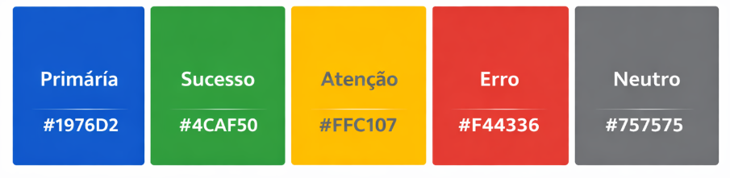

---

## Mobile - Colaborador

Versão Mermaid — Dashboard Mobile (Colaborador)

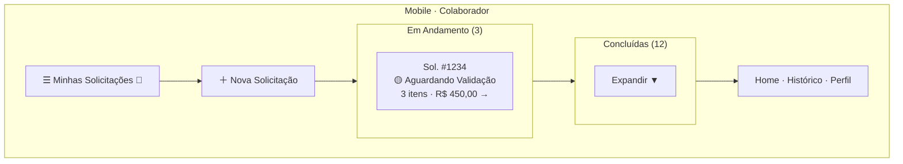
### Criar Solicitação - Adicionar Item

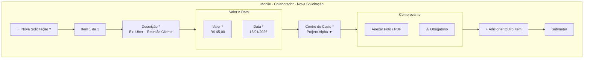

---

## Mobile - Gestor

### Dashboard de Aprovações

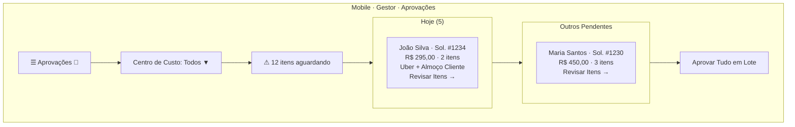

### Aprovar Item (Swipe Interface)

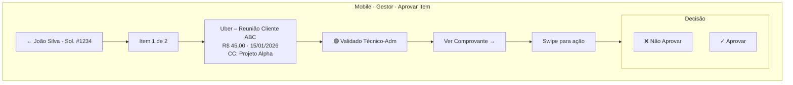

### Modal de Rejeição

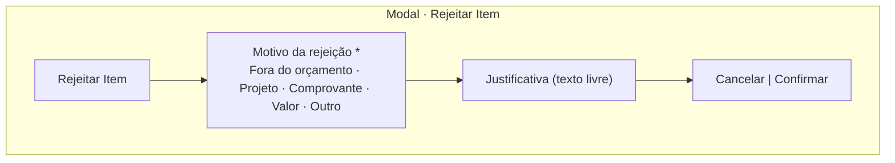
---

## Web - Técnico-Administrativo

### Dashboard de Validação

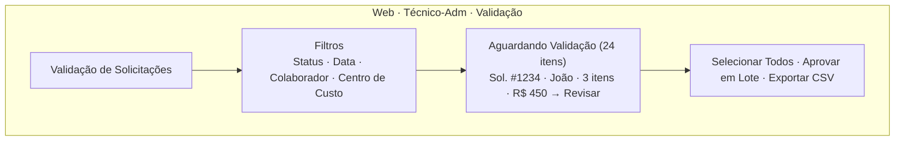
### Validar Itens (Modal)

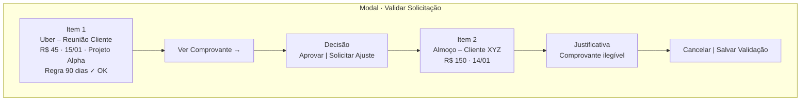
---

## Web - Financeiro

### Dashboard de Pagamentos

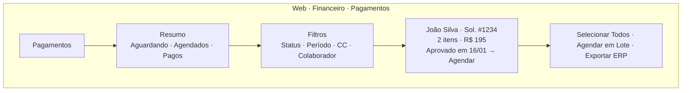
### Agendar Pagamento (Modal)
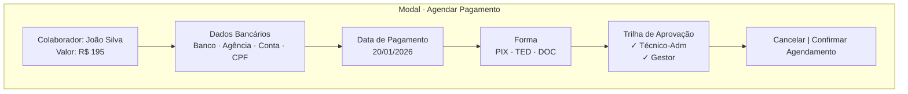

---
### Detalhes da Solicitação

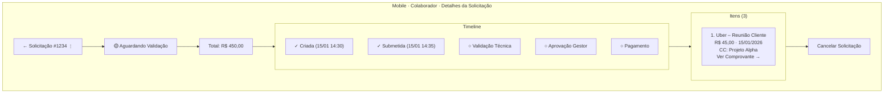

---

## Respresentação de telas via ASCII

## Mobile - Colaborador

### Dashboard / Minhas Solicitações

```
┌───────────────────────────────────────┐
│ ☰  Minhas Solicitações            👤 │
├───────────────────────────────────────┤
│                                       │
│   [+ Nova Solicitação]                │
│                                       │
│   Em Andamento (3)                    │
│   ┌───────────────────────────────┐  │
│   │ Sol. #1234                    │  │
│   │ 🟡 Aguardando Validação       │  │
│   │ 3 itens • R$ 450,00           │  │
│   │                       Ver →   │  │
│   └───────────────────────────────┘  │
│                                       │
│   Concluídas (12)                     │
│   ┌───────────────────────────────┐  │
│   │ Expandir ▼                    │  │
│   └───────────────────────────────┘  │
│                                       │
├───────────────────────────────────────┤
│   Home        Histórico        Perfil │
└───────────────────────────────────────┘
```

### Criar Solicitação - Adicionar Item

```
┌─────────────────────────────────┐
│ <  Nova Solicitação        [?] │
├─────────────────────────────────┤
│                                 │
│ Item 1 de 1                     │
│                                 │
│ ┌─────────────────────────────┐│
│ │ Descrição *                 ││
│ │ [Ex: Uber - Reunião Cliente]││
│ └─────────────────────────────┘│
│                                 │
│ ┌──────────┐  ┌───────────────┐│
│ │ Valor *  │  │ Data *        ││
│ │ R$ 45,00 │  │ 15/01/2026    ││
│ └──────────┘  └───────────────┘│
│                                 │
│ Centro de Custo *               │
│ [Projeto Alpha ▼]               │
│                                 │
│ ┌─ Comprovante ───────────────┐│
│ │                             ││
│ │   [ Anexar Foto/PDF ]       ││
│ │                             ││
│ └─────────────────────────────┘│
│                                 │
│ ⚠️ Comprovante obrigatório      │
│                                 │
│ [+ Adicionar Outro Item]        │
│                                 │
│          [Submeter]             │
│                                 │
└─────────────────────────────────┘
```

### Detalhes da Solicitação

```
┌─────────────────────────────────┐
│ <  Solicitação #1234       ⋮   │
├─────────────────────────────────┤
│                                 │
│ 🟡 Aguardando Validação         │
│                                 │
│ Total: R$ 450,00                │
│                                 │
│ ┌─ Timeline ──────────────────┐│
│ │ ✓ Criada (15/01 14:30)      ││
│ │ ✓ Submetida (15/01 14:35)   ││
│ │ ○ Validação Técnica         ││
│ │ ○ Aprovação Gestor          ││
│ │ ○ Pagamento                 ││
│ └─────────────────────────────┘│
│                                 │
│ ┌─ Itens (3) ─────────────────┐│
│ │                             ││
│ │ 1. Uber - Reunião Cliente   ││
│ │    R$ 45,00 • 15/01/2026    ││
│ │    CC: Projeto Alpha        ││
│ │    [Ver Comprovante >]      ││
│ │                             ││
│ └─────────────────────────────┘│
│                                 │
│     [Cancelar Solicitação]      │
│                                 │
└─────────────────────────────────┘
```

---

## Mobile - Gestor

### Dashboard de Aprovações

```
┌─────────────────────────────────┐
│ ☰  Aprovações             👤   │
├─────────────────────────────────┤
│                                 │
│ Centro de Custo: [Todos ▼]      │
│                                 │
│ ⚠ 12 itens aguardando           │
│                                 │
│ ┌─ Hoje (5) ──────────────────┐│
│ │                             ││
│ │ João Silva - Sol. #1234     ││
│ │ R$ 295,00 • 2 itens         ││
│ │ Uber + Almoço Cliente       ││
│ │                             ││
│ │    [Revisar Itens →]        ││
│ └─────────────────────────────┘│
│                                 │
│ ┌───────────────────────────┐  │
│ │ Maria Santos - Sol. #1230 │  │
│ │ R$ 450,00 • 3 itens       │  │
│ │    [Revisar Itens →]      │  │
│ └───────────────────────────┘  │
│                                 │
│    [Aprovar Tudo em Lote]       │
│                                 │
└─────────────────────────────────┘
```

### Aprovar Item (Swipe Interface)

```
┌─────────────────────────────────┐
│ <  João Silva - Sol. #1234      │
├─────────────────────────────────┤
│                                 │
│ Item 1 de 2                     │
│                                 │
│ ┌─────────────────────────────┐│
│ │ Uber - Reunião Cliente ABC  ││
│ │                             ││
│ │ R$ 45,00                    ││
│ │ Data: 15/01/2026            ││
│ │ CC: Projeto Alpha           ││
│ │                             ││
│ │ 🟢 Validado Técnico-Adm     ││
│ │                             ││
│ │ [Ver Comprovante]           ││
│ └─────────────────────────────┘│
│                                 │
│ ← Swipe para ação              │
│                                 │
│ ┌──────────┐     ┌────────────┐│
│ │  ❌ NÃO  │     │  ✓ SIM     ││
│ │ APROVAR  │     │  APROVAR   ││
│ └──────────┘     └────────────┘│
│                                 │
│ [❌ Rejeitar] [✓ Aprovar]       │
│                                 │
└─────────────────────────────────┘
```

### Modal de Rejeição

```
┌─────────────────────────────────┐
│ Rejeitar Item                   │
├─────────────────────────────────┤
│                                 │
│ Motivo da rejeição: *           │
│                                 │
│ ( ) Fora do orçamento           │
│ ( ) Não relacionado ao projeto  │
│ ( ) Comprovante inválido        │
│ ( ) Valor acima do permitido    │
│ ( ) Outro                       │
│                                 │
│ ┌─────────────────────────────┐│
│ │ Justificativa:              ││
│ │ [Campo de texto]            ││
│ └─────────────────────────────┘│
│                                 │
│   [Cancelar]  [Confirmar]       │
│                                 │
└─────────────────────────────────┘
```

---

## Web - Técnico-Administrativo

### Dashboard de Validação

```
┌────────────────────────────────────────────────────────────────────┐
│ [Logo]  Validação de Solicitações                    João ▼ [Sair] │
├────────────────────────────────────────────────────────────────────┤
│                                                                    │
│  Filtros: [Pendentes ▼] [Data ▼] [Colaborador] [Centro Custo]     │
│                                                                    │
│  ┌──────────────────────────────────────────────────────────────┐ │
│  │ ☐  Aguardando Validação (24 itens)                          │ │
│  ├──────────────────────────────────────────────────────────────┤ │
│  │                                                              │ │
│  │ ☐ Sol. #1234 | João Silva    | 15/01 | 3 itens | R$ 450    │ │
│  │                                                    [Revisar] │ │
│  │                                                              │ │
│  │ ☐ Sol. #1230 | Maria Santos  | 15/01 | 2 itens | R$ 300    │ │
│  │   ✓ Todos comprovantes OK                        [Revisar] │ │
│  │                                                              │ │
│  │                                        [< 1 2 3 ... 8 >]     │ │
│  └──────────────────────────────────────────────────────────────┘ │
│                                                                    │
│  [☐ Selecionar Todos]  [Aprovar em Lote]  [Exportar CSV]          │
│                                                                    │
└────────────────────────────────────────────────────────────────────┘
```

### Validar Itens (Modal)

```
┌────────────────────────────────────────────────────────────────────┐
│ Validar Solicitação #1234 - João Silva                        [X] │
├────────────────────────────────────────────────────────────────────┤
│                                                                    │
│  ┌─ Item 1 de 3 ──────────────────────────────────────────────┐   │
│  │                                                             │   │
│  │  Uber - Reunião Cliente ABC                                │   │
│  │  R$ 45,00 | 15/01/2026 | Projeto Alpha                     │   │
│  │                                                             │   │
│  │  Regra 90 dias: ✓ OK (0 dias atrás)                        │   │
│  │                                                             │   │
│  │  Comprovante: [Ver PDF/Imagem →]                           │   │
│  │                                                             │   │
│  │  Decisão: ( ) Aprovar  ( ) Solicitar Ajuste                │   │
│  │                                                             │   │
│  └─────────────────────────────────────────────────────────────┘   │
│                                                                    │
│  ┌─ Item 2 de 3 ──────────────────────────────────────────────┐   │
│  │                                                             │   │
│  │  Almoço - Cliente XYZ                                      │   │
│  │  R$ 150,00 | 14/01/2026 | Projeto Alpha                    │   │
│  │                                                             │   │
│  │  Decisão: ( ) Aprovar  (•) Solicitar Ajuste                │   │
│  │                                                             │   │
│  │  ┌───────────────────────────────────────────────────────┐ │   │
│  │  │ Justificativa:                                        │ │   │
│  │  │ Comprovante ilegível. Favor anexar nova imagem.       │ │   │
│  │  └───────────────────────────────────────────────────────┘ │   │
│  │                                                             │   │
│  └─────────────────────────────────────────────────────────────┘   │
│                                                                    │
│                            [Cancelar]  [Salvar Validação]         │
│                                                                    │
└────────────────────────────────────────────────────────────────────┘
```

---

## Web - Financeiro

### Dashboard de Pagamentos

```
┌────────────────────────────────────────────────────────────────────┐
│ [Logo]  Pagamentos                                  Maria ▼ [Sair] │
├────────────────────────────────────────────────────────────────────┤
│                                                                    │
│  ┌─ Resumo ──────────────────────────────────────────────────┐    │
│  │  Aguardando Agendamento: 12 itens | R$ 3.450,00          │    │
│  │  Agendados para Hoje: 5 itens | R$ 890,00                │    │
│  │  Pagos Hoje: 3 itens | R$ 540,00                         │    │
│  └────────────────────────────────────────────────────────────┘    │
│                                                                    │
│  Filtros: [Aguardando ▼] [Período] [Centro Custo] [Colaborador]   │
│                                                                    │
│  ┌────────────────────────────────────────────────────────────┐   │
│  │ ☐ João Silva | Sol. #1234 | 2 itens | R$ 195,00           │   │
│  │   Aprovado em: 16/01/2026 14:30                           │   │
│  │   Dados bancários: Banco do Brasil - Ag 1234 - CC 56789   │   │
│  │                                      [Agendar] [Detalhes] │   │
│  └────────────────────────────────────────────────────────────┘   │
│                                                                    │
│  [☐ Selecionar Todos]  [Agendar em Lote]  [Exportar para ERP]     │
│                                                                    │
└────────────────────────────────────────────────────────────────────┘
```


```
┌────────────────────────────────────────────────────────────────────┐
│ Agendar Pagamento                                             [X] │
├────────────────────────────────────────────────────────────────────┤
│                                                                    │
│  Colaborador: João Silva                                          │
│  Valor Total: R$ 195,00                                           │
│                                                                    │
│  Dados Bancários:                                                 │
│  ┌────────────────────────────────────────────────────────────┐   │
│  │ Banco: Banco do Brasil                                     │   │
│  │ Agência: 1234-5                                            │   │
│  │ Conta: 56789-0                                             │   │
│  │ CPF: 123.456.789-00                                        │   │
│  └────────────────────────────────────────────────────────────┘   │
│                                                                    │
│  Data de Pagamento: [20/01/2026] (próximo dia útil)               │
│                                                                    │
│  Forma: ( ) TED  (•) PIX  ( ) DOC                                 │
│                                                                    │
│  ┌─ Trilha de Aprovação ───────────────────────────────────────┐  │
│  │ ✓ Validado por: Ana (Técnico-Adm) - 16/01 10:00            │  │
│  │ ✓ Aprovado por: Carlos (Gestor) - 16/01 14:30              │  │
│  └──────────────────────────────────────────────────────────────┘  │
│                                                                    │
│                            [Cancelar]  [Confirmar Agendamento]    │
│                                                                    │
└────────────────────────────────────────────────────────────────────┘
```

---

## Fluxo de Interação

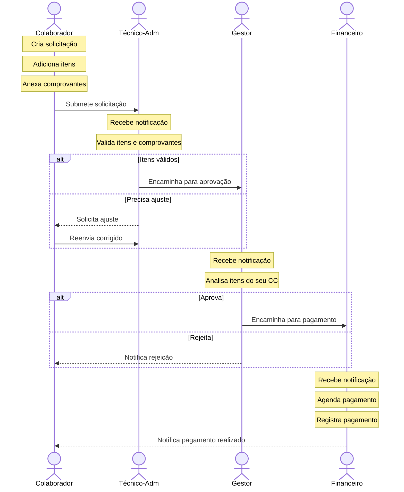

---

[Anterior: High Level Design](02-high-level-design.md) | [Próximo: Requisitos](04-requisitos.md)
