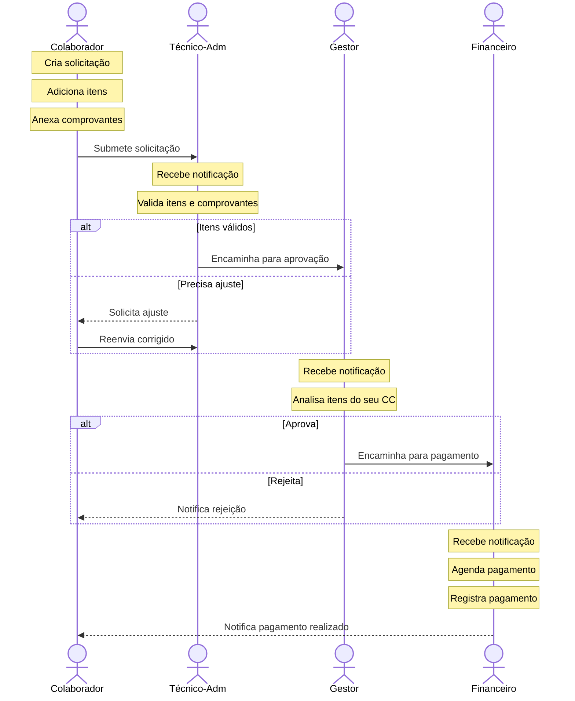

# Protótipos Visuais

[Voltar ao Resumo do projeto](../README.md)

## **Design System:**

- **Mobile-first**: Interface otimizada para mobile, responsiva para web
- **Minimalismo funcional**: Apenas ações críticas visíveis
- **Feedback imediato**: Loading states, confirmações visuais
- **Acessibilidade**: Contraste, tamanhos de fonte, navegação por teclado

**Cores:**

---

## Mobile - Colaborador

## Fluxo de Interação

---

[Anterior: High Level Design](02-high-level-design.md) | [Próximo: Requisitos](04-requisitos.md)
