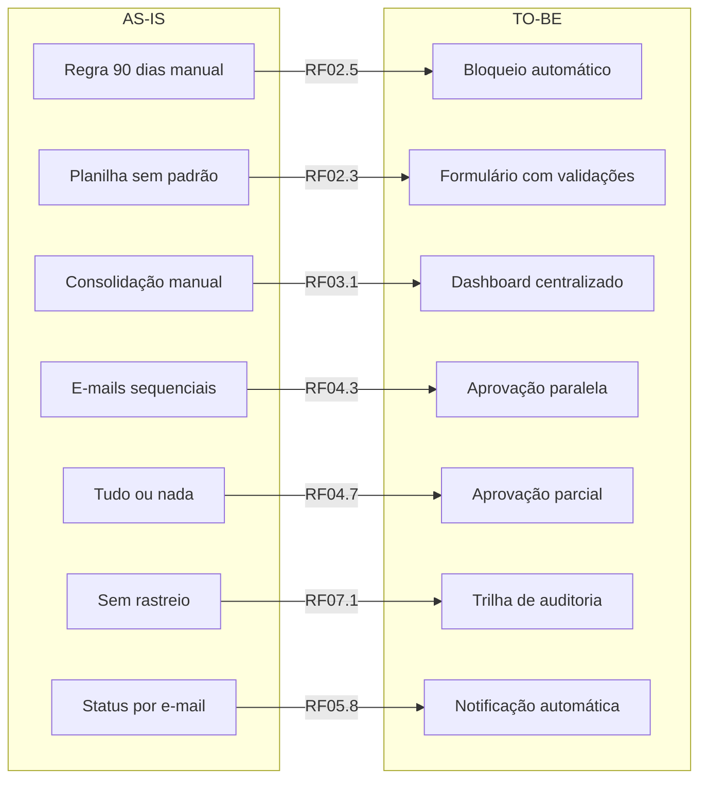

# Requisitos

[Voltar ao Resumo do projeto](../README.md)

## Requisitos Funcionais

### RF01 - Autenticação e Controle de Acesso

| ID | Requisito |
|----|-----------|
| RF01.1 | O sistema deve autenticar usuários via login/senha ou OAuth 2.0 (Google/Microsoft) |
| RF01.2 | O sistema deve implementar RBAC com 4 papéis: Colaborador, Técnico-Adm, Gestor, Financeiro |
| RF01.3 | O sistema deve gerar tokens JWT com expiração de 8 horas |
| RF01.4 | O sistema deve vincular gestores a centros de custo (relação N:N) |
| RF01.5 | O sistema deve exibir apenas centros de custo autorizados para cada usuário |

---

### RF02 - Solicitação de Reembolso (Colaborador)

| ID | Requisito |
|----|-----------|
| RF02.1 | O sistema deve permitir criar solicitações de reembolso com múltiplos itens |
| RF02.2 | O sistema deve gerar número único de solicitação (ex: #YYYY-NNNN) |
| RF02.3 | O sistema deve exigir campos obrigatórios por item: descrição, valor, data, centro de custo, comprovante |
| RF02.4 | O sistema deve validar formato de arquivo do comprovante (PDF, JPG, PNG, máx 10MB) |
| RF02.5 | O sistema deve bloquear itens com data superior a 90 dias |
| RF02.6 | O sistema deve permitir salvar solicitação como rascunho |
| RF02.7 | O sistema deve exibir lista de solicitações agrupadas por status |
| RF02.8 | O sistema deve permitir cancelamento apenas se status for DRAFT ou SUBMITTED |

**Tipos de Comprovante suportados:**

- NFE: Nota Fiscal Eletrônica
- RECEIPT: Recibo simples
- INVOICE: Fatura de serviço

### RF03 - Validação Técnico-Administrativa

| ID | Requisito |
|----|-----------|
| RF03.1 | O sistema deve exibir dashboard de solicitações pendentes de validação |
| RF03.2 | O sistema deve permitir filtros por: data, colaborador, centro de custo |
| RF03.3 | O sistema deve exibir detalhes completos de cada item (dados, comprovante, status 90 dias) |
| RF03.4 | O sistema deve permitir 3 decisões por item: Aprovar, Solicitar Ajuste ou Rejeitar |
| RF03.5 | O sistema deve exigir justificativa (min 10 caracteres) para ajustes e rejeições |
| RF03.6 | O sistema deve permitir validação em lote (múltiplas solicitações) |
| RF03.7 | O sistema deve notificar colaborador sobre itens com ajuste solicitado ou rejeitados |

**Quando usar cada decisão:**
- **Aprovar:** Documentação válida, dentro do prazo, comprovante legível
- **Solicitar Ajuste:** Comprovante ilegível, informação incompleta, erro corrigível
- **Rejeitar:** Documento inválido/fraudulento, duplicidade

### RF04 - Aprovação Gerencial

| ID | Requisito |
|----|-----------|
| RF04.1 | O sistema deve exibir apenas solicitações com itens dos centros de custo do gestor |
| RF04.2 | O sistema deve distribuir itens automaticamente por centro de custo |
| RF04.3 | O sistema deve notificar todos os gestores simultaneamente (aprovação paralela) |
| RF04.4 | O sistema deve permitir 2 decisões por item: Aprovar ou Rejeitar |
| RF04.5 | O sistema deve exigir motivo pré-definido para rejeição |
| RF04.6 | O sistema deve permitir interface swipe-to-approve no mobile |
| RF04.7 | O sistema deve consolidar resultado: aprovados seguem para financeiro |
| RF04.8 | O sistema deve notificar colaborador sobre itens rejeitados com justificativa |

**Motivos de rejeição pré-definidos:**

- Fora do orçamento
- Não relacionado ao projeto
- Comprovante inválido
- Valor acima do permitido
- Outro (com justificativa livre)

---

### RF05 - Pagamentos (Financeiro)

| ID | Requisito |
|----|-----------|
| RF05.1 | O sistema deve exibir dashboard com resumo (aguardando, agendados, pagos) |
| RF05.2 | O sistema deve exibir dados bancários do colaborador |
| RF05.3 | O sistema deve permitir seleção de data e forma de pagamento (TED, PIX, DOC) |
| RF05.4 | O sistema deve exibir trilha de aprovação completa |
| RF05.5 | O sistema deve validar se data de pagamento é dia útil |
| RF05.6 | O sistema deve permitir agendamento em lote |
| RF05.7 | O sistema deve registrar pagamento efetivado com número de transação |
| RF05.8 | O sistema deve notificar colaborador sobre pagamento realizado |

---

### RF06 - Notificações

| ID | Requisito |
|----|-----------|
| RF06.1 | O sistema deve enviar notificações in-app com badge de contador |
| RF06.2 | O sistema deve enviar e-mails transacionais para eventos críticos |
| RF06.3 | O sistema deve consolidar notificações similares (anti-spam, 30 min) |
| RF06.4 | O sistema deve incluir link direto para ação nos e-mails |

**Eventos que geram notificação:**

- Solicitação submetida
- Validação técnica concluída
- Aprovação/rejeição do gestor
- Pagamento agendado
- Pagamento realizado

---

### RF07 - Auditoria e Rastreabilidade

| ID | Requisito |
|----|-----------|
| RF07.1 | O sistema deve registrar todas as ações críticas em log imutável |
| RF07.2 | O sistema deve registrar: who, what, when, where, why |
| RF07.3 | O sistema NÃO deve permitir edição ou exclusão de registros de auditoria |
| RF07.4 | O sistema deve permitir consulta de trilha por solicitação |
| RF07.5 | O sistema deve permitir export de trilha em PDF para auditoria externa |

---
### RF08 - Relatórios e Dashboards

| ID | Requisito |
|----|-----------|
| RF08.1 | O sistema deve exibir métricas: total por status, tempo médio, taxa retrabalho |
| RF08.2 | O sistema deve permitir filtros por período, centro de custo, colaborador |
| RF08.3 | O sistema deve permitir exportação em Excel e PDF |
| RF08.4 | O sistema deve exibir gráficos de evolução e distribuição |

---

## Requisitos Não-Funcionais

### RNF01 - Performance

| ID | Requisito |
|----|-----------|
| RNF01.1 | Tempo de resposta para leitura: até 500ms (p95) |
| RNF01.2 | Tempo de resposta para escrita: até 1s (p95) |
| RNF01.3 | Upload de comprovante (até 10MB): até 3s |
| RNF01.4 | Carregamento de telas mobile: até 2s em 4G |
| RNF01.5 | Compressão de imagens antes de upload (max 2MB) |

---

### RNF02 - Escalabilidade

| ID | Requisito |
|----|-----------|
| RNF02.1 | Suportar até 10.000 colaboradores ativos |
| RNF02.2 | Suportar até 50.000 solicitações/mês |
| RNF02.3 | Suportar até 500 usuários simultâneos |
| RNF02.4 | Suportar até 100 uploads simultâneos |

---

### RNF03 - Disponibilidade

| ID | Requisito |
|----|-----------|
| RNF03.1 | SLA de 99.5% de disponibilidade |
| RNF03.2 | Backup diário do banco de dados |
| RNF03.3 | Manter backups por 30 dias |
| RNF03.4 | Retry automático com backoff exponencial em falhas |

---

### RNF04 - Segurança

| ID | Requisito |
|----|-----------|
| RNF04.1 | Autenticação via OAuth 2.0 + JWT |
| RNF04.2 | Criptografia de dados em trânsito (HTTPS/TLS 1.3) |
| RNF04.3 | Criptografia de dados sensíveis em repouso (AES-256) |
| RNF04.4 | Rate limiting: 100 req/min por usuário |
| RNF04.5 | Proteção contra OWASP Top 10 |

---

### RNF05 - Usabilidade

| ID | Requisito |
|----|-----------|
| RNF05.1 | Interface responsiva (mobile + desktop) |
| RNF05.2 | Tempo para completar tarefa principal: até 2 minutos |
| RNF05.3 | Feedback visual imediato para ações do usuário |
| RNF05.4 | Suporte a navegadores modernos (Chrome, Safari, Firefox, Edge) |
| RNF05.5 | PWA instalável com ícone na home |

---

### RNF06 - Manutenibilidade

| ID | Requisito |
|----|-----------|
| RNF06.1 | Cobertura de testes unitários: mínimo 80% |
| RNF06.2 | Documentação de API via OpenAPI/Swagger |
| RNF06.3 | Code review obrigatório para merge |
| RNF06.4 | CI/CD com deploy automático para staging |

---

### RNF07 - Compliance

| ID | Requisito |
|----|-----------|
| RNF07.1 | Conformidade com LGPD para dados pessoais |
| RNF07.2 | Retenção de comprovantes fiscais por 7 anos |
| RNF07.3 | Segregação de funções (SoD) |
| RNF07.4 | Trilha de auditoria imutável |

**Regras de Segregação de Funções:**

1. Usuário não pode aprovar própria despesa
2. Quem valida não pode aprovar no mesmo item
3. Financeiro só processa pagamentos

---

## Matriz de Rastreabilidade

---

[Anterior: Protótipos](03-prototipos.md) | [Próximo: Planejamento](05-planejamento.md)
