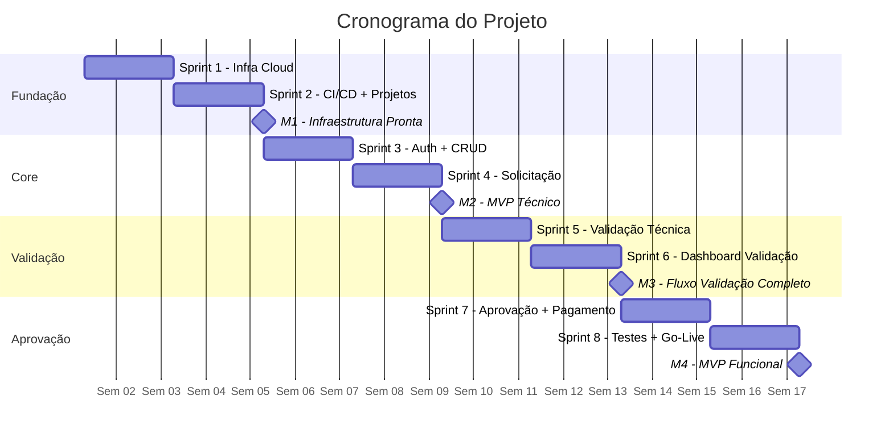

# Planejamento do Projeto

[Voltar ao Resumo do projeto](../README.md)

## 1. Equipe

| Papel | Responsabilidades | Dedicação |
|-------|-------------------|-----------|
| **Tech Lead** | Arquitetura, code review, decisões técnicas, mentoria | 100% |
| **Dev Backend** | API Django + DRF, banco PostgreSQL, integrações | 100% |
| **Dev Frontend** | PWA Vue 3, UX mobile/web, componentes | 100% |
| **Consultor Especialista em Processos Financeiros** | Mapeamento, requisitos, UAT, treinamento | 50-100% |

- Durante o desenvolvimento, o consultor atua sob demanda. Não faz sentido alocá-lo 100% enquanto os desenvolvedores estão codificando. Já na fase de levantamento e validação de requisitos, sua dedicação pode ser maior (até 100%).

---

## 2. Backlog - Épicos

**Abordagem com Story Points (SP)**

SP =  unidade de estimativa ágil que mede o **esforço relativo** de uma tarefa, não o tempo em horas.

| SP | Complexidade | Exemplo |
|----|--------------|---------|
| 1-2 | Muito simples | Corrigir texto, ajustar configuração |
| 3-5 | Simples | CRUD básico, tela simples |
| 8 | Média | Integração com API, lógica de negócio |
| 13 | Complexa | Fluxo completo com múltiplas regras |
| 21+ | Muito complexa | Deve ser quebrada em tarefas menores |

**Velocity (velocidade do time):** Se o time entrega ~34 SP por sprint e o backlog tem 272 SP, então: 272 ÷ 34 ≈ 8 sprints.

| Épico | Descrição | Story Points | % Total |
|-------|-----------|--------------|---------|
| E1 | Fundação Técnica e Infraestrutura | 28 | 10% |
| E2 | Autenticação e Controle de Acesso | 21 | 8% |
| E3 | Solicitação de Reembolso | 47 | 17% |
| E4 | Validação Técnico-Administrativa | 31 | 11% |
| E5 | Aprovação Gerencial | 44 | 16% |
| E6 | Pagamento e Arquivo | 28 | 10% |
| E7 | Notificações | 21 | 8% |
| E8 | Auditoria e Rastreabilidade | 18 | 7% |
| E9 | Testes, Documentação e Go-Live | 34 | 13% |
| **Total** | | **272** | **100%** |

##  3. Organização em Sprints

**Premissas:**

- Sprints de 2 semanas (10 dias úteis)
- Velocity estimada: ~34 Story Points por sprint (média)
- Total de sprints: 8 sprints (16 semanas = 4 meses)

> **Nota:** A carga varia por sprint. Sprints iniciais têm menos SP (fase de setup), sprints finais têm mais SP (integração e go-live). Ajustes de escopo podem ser feitos durante as Sprint Reviews.

### Sprint 0: Kickoff (Semana -1)

**Objetivo:** Alinhamento do time e configuração de ambientes

**Atividades:**
- Reunião de kickoff com cliente
- Configuração de ambientes de desenvolvimento local
- Configuração de repositórios Git, quadro Kanban
- Workshop de mapeamento de processos

### Sprint 1-2: Fundação Técnica

**Story Points:** 28 SP (14 SP/sprint)

**Entregáveis:**
- Infraestrutura cloud provisionada
- CI/CD funcionando
- Projetos Django + Vue 3 configurados
- Observabilidade básica

**Marco M1:** Infraestrutura Pronta

### Sprint 3-4: Autenticação + Solicitação Básica

**Story Points:** 68 SP (34 SP/sprint) - Épicos E2 + E3

**Entregáveis:**
- Login OAuth funcional com RBAC
- Colaborador cria solicitação com itens
- Upload de comprovantes funcionando
- App mobile básico funcional

**Marco M2:** MVP Técnico (Autenticação + CRUD)

### Sprint 5-6: Validação + Aprovação

**Story Points:** 75 SP (37-38 SP/sprint) - Épicos E4 + E5

**Entregáveis:**
- Dashboard web de validação técnica
- Fluxo completo de validação funcional
- Solicitação de ajustes funcionando
- Dashboard mobile de aprovação gerencial
- Lógica de aprovação parcial

**Marco M3:** Fluxo de Validação e Aprovação Completo

### Sprint 7-8: Pagamento + Notificações + Go-Live

**Story Points:** 101 SP (50-51 SP/sprint) - Épicos E6 + E7 + E8 + E9

**Entregáveis:**
- Dashboard de pagamentos
- Sistema de notificações (e-mail + in-app)
- Trilha de auditoria completa
- Testes end-to-end
- Documentação e treinamento
- Go-live

**Marco M4:** MVP Funcional (Fluxo Core Completo)

> **Milestone crítico:** Apresentação ao cliente + Coleta de feedback

## 4. Marcos do Projeto (Milestones)

| Marco | Sprint | Semana | Entrega | Critério de Sucesso |
|-------|--------|--------|---------|---------------------|
| **M1** | 2 | 4 | Setup completo | Deploy automático funcionando |
| **M2** | 4 | 8 | Auth + CRUD | Colaborador cria solicitação |
| **M3** | 6 | 12 | Validação | Técnico-adm valida itens |
| **M4** | 8 | 16 | **MVP Completo** | Fluxo end-to-end testado |

## 5. Gestão de Riscos

### Matriz de Riscos

| ID | Risco | Probabilidade | Impacto | Estratégia de Mitigação |
|----|-------|-------|---------|-------------------------|
| R1 | **Mudança de requisitos** durante o projeto | Média | Alto | Sprints curtas (2 sem) + feedback frequente + backlog priorizado |
| R2 | **Baixa adoção** pelos usuários finais | Média | Alto | UAT com usuários reais desde M2 + treinamento + interface intuitiva |
| R3 | **Resistência do técnico-adm** ao novo processo | Média | Médio | Envolvimento desde o kickoff + demonstrar redução de trabalho manual |
| R4 | **Integração OAuth** mais complexa que previsto | Baixa | Médio | PoC na Sprint 1 + biblioteca consolidada (django-allauth) |
| R5 | **Subestimativa de esforço** técnico | Média | Médio | Buffer de 20% nas sprints + refinamento contínuo do backlog |
| R6 | **Indisponibilidade** de membro do time | Baixa | Alto | Documentação contínua + pair programming + conhecimento distribuído |
| R7 | **Performance insuficiente** no mobile | Baixa | Médio | Testes de carga antecipados + otimização progressiva |
| R8 | **Escopo creep** (expansão não controlada) | Média | Alto | Backlog fechado por sprint + mudanças só entram na próxima sprint |

### Plano de Contingência

| Risco | Se ocorrer... | Ação imediata |
|-------|---------------|---------------|
| R1 | Requisito crítico muda no meio da sprint | Avaliar impacto + negociar troca por item de menor prioridade |
| R2 | Usuários não adotam na fase piloto | Sessões de feedback + ajustes de UX|
| R6 | Dev fica indisponível por mais de 1 semana | Tech Lead assume tasks críticas + redistribuir backlog |
| R8 | Stakeholder pede feature fora do escopo | Documentar como Fase 2 + manter foco no MVP acordado |

### Acompanhamento e Cerimônias Ágeis

- **Frequência:** Revisão de riscos a cada Sprint Review
- **Responsável:** Tech Lead + Consultor Especialista em Processos Financeiros
- **Registro:** Atualização da matriz no quadro do projeto

| Cerimônia | Frequência | Duração | Participantes |
|-----------|------------|---------|---------------|
| Daily Standup | Diária | 15 min | Time completo |
| Sprint Planning | Quinzenal | 1h | Time completo |
| Sprint Review | Quinzenal | 1h | Time + stakeholders |
| Sprint Retrospective | Quinzenal | 1h | Time completo |
| Backlog Refinement | Semanal | 1h | Tech Lead + Consultor |

## 6. Definição de Pronto (Definition of Done - DoD)

Uma User Story é considerada **DONE** quando:

- [ ] Código implementado e revisado (code review)
- [ ] Testes unitários passando
- [ ] Testes de integração passando
- [ ] Deploy realizado em staging
- [ ] Documentação atualizada (se aplicável)

[Anterior: Requisitos](04-requisitos.md) | [Voltar ao README](../README.md)
